<h2>Introdução</h2>
Sou estudante de Banco de Dados na Fatec de São José dos Campos, SP. Iniciei meu curso em março de 2023, com previsão de conclusão em dezembro de 2025.
O principal motivador que me trouxe à Fatec foi a recomendação de ex-alunos.

Minha trajetória profissional teve início em março de 2023, quando tive a oportunidade de ingressar no mercado de trabalho como desenvolvedor web, atuando com Python e JavaScript. Permaneci nesse primeiro projeto por um ano, até que, em março de 2024, recebi a chance de atuar em um novo projeto na área de telecomunicações. Neste novo desafio, passei a atuar como desenvolvedor Java e a lidar com o banco de dados Oracle.

Atualmente, estou efetivado na <a href="https://www.fitec.org.br">Fitec (Inovações Tecnológicas)</a>, onde continuo contribuindo para um projeto no setor de telecomunicações, utilizando Java e Oracle como banco de dados.

<h2>Contato</h2>

[GITHUB](https://github.com/pauloarantesmachado)

[LINKEDIN](https://www.linkedin.com/in/pauloantonioarantesmachado/)

---

<h2>Meus principais conhecimentos</h2>
Tenho experiência prática no desenvolvimento web Java, com foco em backend, e busco constantemente o aprimoramento nesta área.
Desde o segundo semestre da FATEC, após o primeiro contato com a linguagem Java, direcionei meus estudos e aprofundamento de forma contínua para o universo do desenvolvimento. Atualmente, minha stack tecnológica é a seguinte:

| Nome da Tecnologia | Breve Descrição |
| :--- | :--- |
| Java | Linguagem de programação principal, utilizada para desenvolvimento backend. |
| Spring | Framework essencial para criar aplicações robustas e escaláveis, como APIs e microsserviços. |
| Hibernate | Framework de Mapeamento Objeto-Relacional (ORM), facilitando a interação com o banco de dados. |
| Oracle Database | Sistema gerenciador de banco de dados (SGBD) relacional de nível empresarial. |
| PostgreSQL | SGBD relacional open source, conhecido por sua robustez e recursos avançados. |
| Git | Sistema de controle de versão distribuído, fundamental para o trabalho colaborativo. |
| Container (Docker) | Tecnologia de virtualização leve para empacotar e executar aplicações em ambientes isolados e consistentes. |
| Linux | Sistema operacional utilizado para ambiente de desenvolvimento e deploy (servidores). |
| Bash Script | Linguagem de script utilizada para automação de tarefas e gerenciamento no ambiente Linux. |
| Maven | Ferramenta de gerenciamento de dependências e construção de projetos Java. |
| Gradle | Ferramenta alternativa ao Maven, focada em flexibilidade e construção rápida de projetos. |
| JUnit | Framework para o desenvolvimento e execução de testes unitários em Java. |
| Mockito | Framework de mocking para isolar e simular dependências em testes unitários. |
| JMeter | Ferramenta para testes de performance e carga em aplicações web. |
| Robot Test | Framework de automação de testes aceitação e testes funcionais (Geralmente usado para testes de UI/End-to-End). |
| Eclipse IDE | Ambiente de Desenvolvimento Integrado (IDE) utilizado para codificação e debugging de projetos Java. |


<h2>Minhas principais experiências</h2>
Minha trajetória como desenvolvedor iniciou com o Front-end, onde adquiri experiência com o framework Angular. Evoluí para o Back-end em projetos, utilizando Flask e Python.

Atualmente, minha atuação está concentrada no desenvolvimento e manutenção de softwares no setor de telecomunicações. Possuo experiência prática no desenvolvimento em:

- Desenvolvimento Core: Atuo com a linguagem Java e o banco de dados Oracle, incluindo o desenvolvimento e manutenção de sistemas legados.

- DevOps e Integração Contínua: Utilizo Jenkins para automatizar o processo de build, a geração de imagens Docker (containers) e o acompanhamento dos testes durante o pipeline de integração contínua.

- Ambiente e Ferramentas: Possuo conhecimento em ambientes Unix/Linux, utilizando o MobaXterm para acesso e administração de máquinas.

- Testes: Tenho experiência prática em testes unitários com Mockito e JUnit, e em testes de integração e aceitação utilizando o Robot Framework.

---

<h2>Objetivos Futuros</h2>
Busco me especializar em arquitetura de software para consolidar minha base técnica como desenvolvedor. Meu foco agora é investir em um Mestrado em Engenharia de Software.

---

<br>

<h2 style="text-align: center;">💻PROJETOS API Fatec</h2>

<h2 style="text-align: center;">Projeto: Sistema de Avaliação 360° (Primeiro semestre 2023-1)</h2>

<h3>Empresa</h3>
Trabalho realizado como projeto interno, tendo o Professor Lucas Nadalete como Cliente Principal.

<h3>Problema</h3>
O problema central que a PBLTeX enfrenta é a incompatibilidade entre uma metodologia de ensino (PBL com Avaliação Democratizada 360º) e um processo de coleta de dados obsoleto, manual e em papel.
A principal dor do cliente é a impossibilidade de gerenciar e validar as Avaliações 360º de forma eficiente, justa e em escala, devido ao uso de formulários físicos.

<h3>Objetivo da aplicação</h3>
O programa viabiliza a avaliação dos alunos, se baseando na metodologia Avaliação 360º. Para liberar o acesso ao programa, teremos 2 niveis de acesso: Administrador e Aluno. Dependendo do tipo de acesso, havera opções de tela diferentes. A tela "aluno" possibilitará ao usuário ver a turma e o grupo ao qual está inserido, avaliar os membros do seu grupo e se auto-avaliar, podendo ver os resultados das avaliações realizadas por ele. O "Administrador" terá atribuições de criar as turmas, grupos e o registro dos alunos, requisitar a avaliação e observar os resultados da mesma, atraves de dashboards operacionais e gerenciais.

<h3>Funcionalidades</h3>

<h4>Funcionalidades do Perfil: Aluno</h4>
<ul>
  <li>Realizar login com usuário e senha</li>
  <li>Acessar a Interface de Aluno</li>
  <li>Avaliar a si mesmo e aos seus colegas</li>
  <li>Visualizar gráficos de desempenho gerados pela sua avaliação</li>
</ul>

<h4>Funcionalidades do Perfil: Administrador</h4>
<ul>
  <li>Realizar o login com usuário e senha</li>
  <li>Acessar a Interface de administrador</li>
  <li>Realizar o cadastro de alunos, grupos e turmas</li>
  <li>Configurar sprint das turmas</li>
  <li>Visualizar lista de turmas e grupos</li>
  <li>Visualizar gráficos de desempenho gerados pelas avaliações dos grupos e das turmas.</li>
</ul>


Link da aplicação: <a href="https://github.com/wiz-fatec/avaliacao-360">Avaliação -360</a>

<div style="text-align: center;">
    <b>Tecnologias Utilizadas no Projeto</b>
    <div>
        <a href="https://www.figma.com/pt-br/" target="_blank"></a>
        <a href="https://git-scm.com/" target="_blank"></a>
        <a href="https://github.com/" target="_blank"></a>
        <a href="https://www.python.org/" target="_blank"></a>
        <a href="https://www.mongodb.com/" target="_blank"></a>
        <a href="https://trello.com/" target="_blank"></a>
    </div>
</div>

<br>

|Nome|Descrição|
 :--------: | :-------- |
|[FIGMA](https://www.figma.com/pt-br/)|O Figma foi a ferramenta central utilizada para a etapa de design de interface (UI) e planejamento da experiência do usuário (UX) do sistema de Avaliação.|
|[GIT](https://git-scm.com/)|O Git foi a ferramenta padrão selecionada e utilizada para o versionamento e controle do código-fonte em nosso projeto.|
|[GITHUB](https://github.com/)|O GitHub foi a plataforma escolhida para hospedar e gerenciar nosso repositório Git|
|[PYTHON](https://docs.python.org/pt-br/dev/faq/general.html)|Python foi a linguagem de programação utilizada para desenvolver o sistema, e a biblioteca PySimpleGUI foi empregada especificamente para a criação das interfaces gráficas.|
|[VSCODE](https://code.visualstudio.com/)|Utilizou-se o Visual Studio Code (VS Code) como editor de código-fonte durante o desenvolvimento.|
|[TRELLO](https://trello.com/)|O Trello foi a ferramenta utilizada para a gestão das tarefas, aplicando-se a metodologia Kanban para o acompanhamento dos cards.|


<br>
<h3>Contribuições Pessoais</h3>
Participei do projeto como desenvolvedor e designer, ajudando a criar a aparência e o funcionamento da aplicação. Também dei suporte à equipe em várias tarefas, contribuindo para que tudo fosse feito da melhor forma possível.

<details>
<summary>Criação do WireFrame</summary>
 Desenhei o fluxo de telas da aplicação, com caminhos específicos para alunos e administradores. Isso ajudou a equipe a entender melhor como a solução funcionaria e facilitou o desenvolvimento do projeto.
    <ul>
        <li><b>Criação do Fluxo do Aluno</b>: Desenhei a tela de informações do aluno, as telas de avaliação e a tela de resultados. Nesta última, o aluno pode visualizar o feedback recebido, facilitando o entendimento do seu desempenho.</li>
        <li><b>Criação de Fluxo Admin</b>: Desenhei a tela inicial (home) do administrador, a tela para criar novas turmas, grupos ou alunos, a tela de resultados das avaliações, a tela para visualizar turmas e grupos, e também a tela de requisição de avaliações.</li>
        <li><b>Criação da tela de login</b>: Desenhei a tela de login, permitindo que o usuário acesse a aplicação por meio de um nome de usuário e senha.</li>
    </ul>
</details>

<details>
<summary>Atualizações no arquivo Readme da aplicação.</summary>
 Contribuí com melhorias no README do projeto, deixando as informações mais claras e organizadas. Adicionei detalhes importantes, como as tecnologias utilizadas, os nomes dos participantes e o backlog com as principais tarefas do projeto. Também cuidei de deixar o visual mais agradável, facilitando a leitura e o entendimento para quem acessa.
</details>

<details>
<summary>Desenvolvimento das telas do fluxo de Aluno.</summary>
Desenvolvi uma funcionalidade para a tela do aluno, adicionando botões e escolhas que permitem navegar para outras partes do sistema de forma simples. Usei o PySimpleGUI, uma ferramenta que ajuda a criar telas de maneira prática e rápida, o que facilitou bastante o processo de construção dessa parte da aplicação.
</details>

<details>
<summary>Desenvolvimento da tela mostrar dados do aluno.</summary>
Desenvolvi a interface responsável por exibir os resultados das avaliações, mostrando de forma clara os valores relacionados ao desempenho do aluno e também do grupo ao qual ele pertence. Essa tela foi criada utilizando a biblioteca PySimpleGUI, que facilitou bastante na hora de montar a interface de maneira simples, prática e visualmente organizada. Com isso, os usuários conseguem visualizar seus resultados de forma intuitiva, entendendo melhor seu desempenho individual e em grupo dentro da aplicação.
</details>

<details>
<summary>Desenvolvimento da tela para mostrar dados gerais relacionada ao aluno em um Dash.</summary>
Desenvolvi a interface que exibe os valores de avaliação do aluno e de seu grupo em formato de dashboard, facilitando a visualização e compreensão dos dados de desempenho. Para isso, utilizei a biblioteca PySimpleGUI, que tornou a criação das telas mais simples e rápida, permitindo montar uma interface amigável e de fácil navegação.

Além disso, integrei a biblioteca Matplotlib para gerar gráficos visuais dentro da própria interface. Com isso, os alunos podem acompanhar seus resultados de forma clara e interativa, por meio de representações visuais como gráficos de radar e de  barra, comparando seu desempenho individual com o do grupo. Essa abordagem tornou a experiência mais dinâmica e informativa para os usuários.
</details>

<details>
<summary>Prestei apoio a alguns membros da equipe nas questões técnicas.</summary>
Colaborei ativamente com alguns membros da equipe em diversas tarefas ao longo do projeto, oferecendo suporte técnico e ajudando na resolução de dúvidas. Contribuí especialmente em questões relacionadas à linguagem Python, auxiliando na escrita de código e na compreensão da lógica de programação.

Também apoiei o time no entendimento e uso do Git, explicando como funciona o versionamento de código, ajudando na criação de branches, commits e no controle das alterações de forma organizada. Essa troca de conhecimento foi importante para garantir um bom fluxo de trabalho em equipe e fortalecer a colaboração entre todos os integrantes do projeto..
</details>

<br>

<h2>Hard Skills</h2>

|Nome|Descrição|Nível
| :--------: | :-------- | :-------- |
|Python|Durante o projeto, trabalhei com a biblioteca PySimpleGUI, que me ajudou a criar as interfaces da aplicação de maneira simples e direta. Com ela, consegui montar as telas e deixar o sistema mais fácil de usar. Também aprendi bastante sobre a linguagem Python e seus recursos. Foi uma ótima chance de aplicar, na prática, o que vinha estudando. Esse projeto me ajudou a entender melhor como usar o Python em uma aplicação real, de forma didática e bem próxima do dia a dia de um desenvolvedor.|★★★★☆|
|Git|Durante o projeto, participei da criação de branches e ajudei minha equipe com a organização dos commits e o uso de Pull Requests. Além disso, aprendi na prática como funciona o versionamento de branches no Git e conheci recursos que até então não tinha usado, como o git stash, que me ajudou a guardar alterações temporárias, e o git cherry-pick, que permite aplicar um commit específico em outra branch. Esses aprendizados foram importantes para melhorar minha organização no controle de versões e colaborar melhor com o time.|★★★★☆|
---
<br>

<h2>Soft Skills</h2>

Nome|Descrição|
| :-------- | :-------- |
|Trabalho em equipe|Ajudei meu time a resolver algumas dúvidas sobre a linguagem de programação e também sobre o controle de versões do código.Além disso, aprendi como funciona a metodologia ágil Scrum e entendi a importância das reuniões diárias (dailys). Nessas reuniões, a equipe compartilhava os desafios que estavam enfrentando e conversava para encontrar soluções juntos, o que ajudou muito no andamento do projeto.|
|Gestão de Tempo|Entreguei minhas tarefas dentro do prazo combinado, ajudando a evitar atrasos no projeto.Com as sprints e a pontuação das tarefas, consegui organizar melhor meu tempo e cumprir o que foi planejado.|

---

<br>

<h2 style="text-align: center;">Projeto: Sistema TG Manager: Gestão Inteligente de Avaliações, Feedbacks e Relatórios para Trabalhos de Graduação (Segundo semestre 2023-2)</h2>

<h3>Empresa</h3>
Trabalho realizado como Projeto Interno, tendo o Professor Emanuel Mineda como Cliente Principal.

<h3>Problema</h3>
O processo de gestão de TG era ineficiente, pois era realizado totalmente via planilhas Excel. Isso gerava um grande obstáculo na análise e acompanhamento da correta alocação e vínculo dos Trabalhos de Graduação (TGs) com seus orientadores.

<h3>Objetivo da aplicação</h3>
Os objetivos da aplicação são: carregar o arquivo ".csv" para trazer uma maior facilidade na visualização dos dados e fornecer as possibilidades de anotações nas avaliações dos Trabalhos de Graduação, tais como feedback e nota do aluno em sua entrega. Também será possível agendar as entregas e definir as quantidades de entregas visto que a nota será baseado em uma média de notas que serão distribuidas nestas entregas. Por fim gerar relatórios com informações úteis ao usário, para que consiga gerenciar as turmas e facilitar a rotina e pendências das apresentações.

<h3>Funcionalidades</h3>

<ul>
  <li>Carregar arquivo ".csv"</li>
  <li>Verificar informações do aluno</li>
  <li>Controlar a quantidade de entregas</li>
  <li>Agendar data das entregas</li>
  <li>Atribuir nota por entrega por aluno</li>
  <li>Atribuir feedback por entrega por aluno</li>
  <li>Gerar relatório individual de cada aluno</li>
  <li>Gerar relatório geral de todos os alunos</li>
  <li>Gerar relatório que liste alunos aptos à defesa de sua TG com dados do orientador</li>
</ul>


Link da aplicação: <a href="https://github.com/wiz-fatec/api-2BD">Sistema TG Manager</a>

<div style="text-align: center;">
    <b>Tecnologias Utilizadas no Projeto</b>
    <div>
        <a href="https://www.figma.com/pt-br/" target="_blank"></a>
        <a href="https://git-scm.com/" target="_blank"></a>
        <a href="https://github.com/" target="_blank"></a>
        <a href="https://docs.oracle.com/en/java/javase/17/" target="_blank"></a>
        <a href="https://maven.apache.org/" target="_blank"></a>
        <a href="https://www.postgresql.org/docs/" target="_blank"></a>
        <a href="https://code.visualstudio.com/" target="_blank"></a>
        <a href="https://www.jetbrains.com/pt-br/idea/" target="_blank"></a>
    </div>
</div>

Nome|Descrição|
 :--------: | :-------- |
|[FIGMA](https://www.figma.com/pt-br/)|O Figma foi a ferramenta central utilizada para a etapa de design de interface (UI) e planejamento da experiência do usuário (UX).|
|[GIT](https://git-scm.com/)|O Git foi a ferramenta padrão selecionada e utilizada para o versionamento e controle do código-fonte em nosso projeto|
|[GITHUB](https://github.com/)|O GitHub foi a plataforma escolhida para hospedar e gerenciar nosso repositório Git.|
|[JAVA](https://docs.oracle.com/en/java/javase/17/)|A linguagem Java foi utilizada para a implementação da regra de negócio (ou backend) do sistema, e o framework JavaFX foi empregado para a criação das interfaces gráficas de usuário (GUIs).|
|[MAVEN](https://maven.apache.org/)| A gestão de dependências e a criação do artefato final (JAR) da aplicação foram realizadas por meio do Maven.|
|[POSTGRESQL](https://www.postgresql.org/docs/)|O PostgreSQL foi o Sistema Gerenciador de Banco de Dados (SGBD) escolhido para o projeto.|
|[VSCODE](https://code.visualstudio.com/)|Utilizou-se o Visual Studio Code (VS Code) como editor de código-fonte durante o desenvolvimento|
|[INTELLIJ](https://www.jetbrains.com/pt-br/idea/)|Utilizou-se o IntelliJ como IDE para o JAVA|

<br>
<h3>Contribuições Pessoais</h3>
Trabalhei como desenvolvedor Java em um projeto organizado seguindo a arquitetura MVC, que divide o sistema em três partes: o Model, responsável pelas regras de negócio e dados; a View, que é a parte visual que o usuário vê; e o Controller, que faz a ligação entre o Model e a View, coordenando as ações.
Minha maior responsabilidade foi na parte do Model, cuidando das regras de negócio. Também ajudei na criação das telas e dos elementos visuais usando JavaFX, que fazem parte da View. Além disso, ofereci suporte para a equipe em várias tarefas durante o desenvolvimento.

<details>
<summary>Conexão com o Banco de Dados</summary>
 Realizei a conexão da aplicação com o banco de dados PostgreSQL, permitindo o armazenamento das informações relacionadas às entidades do sistema. Para isso, incluí a dependência do PostgreSQL no arquivo pom.xml, para que o projeto pudesse se comunicar corretamente com o banco.
    <ul>
        <li><b>Adição da dependência do PostgreSQL:</b> Neste projeto, utilizamos o Maven para gerenciar as dependências, por isso foi necessário adicionar a dependência do PostgreSQL no arquivo de configuração. Isso permitiu que o projeto tivesse acesso ao driver necessário para se conectar ao banco de dados corretamente.
        </li>
        <li><b>Adição da classe para realizar a conexão com o banco usando JDBC:</b> Criei uma classe responsável por fazer a comunicação entre a aplicação e o banco de dados PostgreSQL utilizando JDBC. Essa classe foi importante para centralizar a lógica de conexão, facilitando o acesso ao banco em diferentes partes do sistema.</li>
    </ul>
        Exemplo de uma Classe de Conexão:
        
        ```java
        public class ConnectionDatabase {

            private static final String URL = "jdbc:postgresql://localhost:5432/seu_banco";
            private static final String USER = "seu_usuario";
            private static final String PASSWORD = "sua_senha";
            private static Connection conn;

            public static Connection getConexao() {
                try {
                    if (conn == null || conn.isClosed()) {
                        Class.forName("org.postgresql.Driver");
                        conn = DriverManager.getConnection(URL, USER, PASSWORD);
                        System.out.println("Conexão com o banco estabelecida com sucesso.");
                    }
                    return conn;
                } catch (SQLException e) {
                    System.out.println("Erro: Falha na conexão com o banco de dados.");
                    e.printStackTrace();
                    return null;
                } catch (ClassNotFoundException e) {
                    System.out.println("Erro: Driver JDBC do PostgreSQL não encontrado.");
                    e.printStackTrace();
                    return null;
                }
            }
        }
</details>

<details>
<summary>Classes Model</summary>
Como o projeto não utilizou nenhum ORM (como Hibernate), foi necessário desenvolver manualmente as classes responsáveis pela comunicação com o banco de dados.
Criei as classes modelando as entidades do sistema, definindo seus atributos e adicionando métodos que representavam as operações de SELECT, INSERT, UPDATE e DELETE no banco PostgreSQL. Além disso, nessas classes também foram implementadas regras de negócio específicas da aplicação, garantindo que os dados estivessem sempre consistentes antes de serem salvos ou modificados.
Cada model também continha métodos que executavam diretamente os comandos SQL, o que exigiu atenção especial à estrutura das queries e ao tratamento das conexões via JDBC. Foi um processo bem prático que ajudou a entender melhor como funciona a integração direta entre o Java e o banco de dados.
Exemplo de classe Model:
    
    ```java 
    public class TeamModel {
        private Integer id;
        private Integer semester;
        private Integer year;

        public static void addTeam(Integer semester, Integer year) {
            try {
                ConnectionDataBase connectionDb = new ConnectionDataBase();
                Connection connection = connectionDb.getConexao();
                String insercaoSQL = "INSERT INTO turma (semestre, ano) VALUES (?, ?) ON CONFLICT DO NOTHING";
                PreparedStatement preparedStatement = connection.prepareStatement(insercaoSQL);
                preparedStatement.setInt(1, semester);
                preparedStatement.setInt(2, year);
                System.out.println(preparedStatement.executeUpdate());
                preparedStatement.close();
                System.out.println("Dados inseridos com sucesso!");
            } catch (SQLException e) {
                e.printStackTrace();
            }
        }

        public static Set<TeamModel> getSubmit(){
            try {
                ConnectionDataBase connectionDb = new ConnectionDataBase();
                Connection connection = connectionDb.getConexao();
                Statement statementDb = connection.createStatement();
                ResultSet result = statementDb.executeQuery("SELECT * from turma");
                Set<TeamModel> teamList = new HashSet<>();
                while (result.next()) {
                    TeamModel team = new TeamModel();
                    Integer idTeam = result.getInt("id");
                    team.setId(idTeam);
                    Integer semester = result.getInt("semestre");
                    team.setSemester(semester);
                    Integer year = result.getInt("ano");
                    team.setYear(year);
                    teamList.add(team);
                }
                return teamList;
            } catch (SQLException ex) {
                ex.printStackTrace();
                return null;
            }
        }
    }

</details>

<details>
<summary>Criação da classe Email Validator seguindo o princípio do solid ('Single Responsibility') </summary>
Criei uma classe específica para fazer a validação dos campos de e-mail presentes nos arquivos CSV enviados para o sistema. Nessa classe, foram implementados dois métodos estáticos: um deles verifica se o e-mail informado contém o caractere @, que é essencial para validar se o e-mail tem um formato básico correto.
O outro método foi pensado para lidar com casos onde o e-mail institucional da FATEC não está preenchido. Quando isso acontece, o sistema automaticamente verifica se há um e-mail pessoal disponível e utiliza esse como alternativa. Essa lógica ajuda a evitar que informações importantes fiquem em branco e garante que os dados estejam completos no momento de serem armazenados no banco de dados.
Classe EmailValidator:
            
    ```java 
    public class EmailValidator {
        public static boolean validatorEmail(String email){

            if(email.contains("@")){

                return true;
            }
            throw  new RuntimeException("Email invalid");
        }

        public static String validatorEmailFatec(String fatecEmail, String personEmail){
            String email = fatecEmail;
            if(fatecEmail.isEmpty()){
            return email = personEmail;
            }
            return email;
        }

    }

</details>

<details>
<summary>Criação do Enum modelo de TG</summary>
Criei um enum com quatro tipos de TG: PORTFOLIO, ARTICLE, DISCIPLINE e INTERNSHIP. A ideia foi padronizar as opções disponíveis e garantir que, durante a leitura do arquivo CSV, o sistema conseguisse identificar corretamente qual tipo de trabalho foi escolhido para cada aluno.Com o uso do enum, ficou mais seguro fazer essa validação, evitando erros de digitação ou entradas inválidas no arquivo. Além disso, deixou o código mais organizado, já que as opções ficaram centralizadas em um único lugar e bem definidas.
Classe ModelTgEnum:
    
    ```java        
    public enum ModelTGEnum {
        PORTIFOLIO("Portfólio (Exige participação em todos os 6 APIs)"),
        ARTICLE("Artigo Tecnológico ou Científico"),
        DISCIPLINE("Relatório Técnico - Disciplina (Somente para quem não pode participar de 6 APIs)"),
        INTERNSHIP("Relatório Técnico - Estágio (Somente para quem não pode participar de 6 APIs. Autorizado pela empresa)");

        private String description;

        ModelTGEnum(String description){
            this.description = description;
        }
        public String getDescription(){
            return description;
        }
    }

</details>

<details>
<summary>Criação do Controller para enviar o arquivo csv para o Model </summary>
Criei uma classe chamada CsvHandler, que foi pensada justamente para lidar com os dados vindos dos arquivos CSV que os usuários enviam para o sistema. Dentro dessa classe, desenvolvi um método principal que recebe como parâmetro uma matriz (um array de arrays), que representa as linhas e colunas dos dados do arquivo. Cada linha da matriz é basicamente um aluno, e as colunas trazem informações como o nome do orientador, semestre, tipo de TG, entre outros.Esse método faz um papel importante no fluxo: ele pega os dados dessa matriz e envia as informações corretamente para a parte do sistema que cuida dos orientadores. Ele identifica, por exemplo, em qual semestre o aluno está e qual o tipo de trabalho de conclusão ele escolheu (como PORTFOLIO, ARTICLE, DISCIPLINE ou INTERNSHIP, usando o enum que criamos). Essa organização permitiu que os dados fossem repassados corretamente para os modelos da aplicação, garantindo que tudo fosse salvo no banco de dados de forma estruturada e sem erros. A criação dessa classe ajudou bastante a tornar o processo de leitura, validação e envio das informações mais claro e fácil de manter dentro do sistema.
Classe CSVHandler
            
    ```java
    public class CSVHandler {

        public static void populateDataBase(List<List<String>> dataList) {

            AdvisorController.addAdivisor(dataList);
            TeamController.addTeam();
            StudentController.addAStudent(dataList);
            TGController.addATg(dataList);
        }
 
    }

</details>

<details>
<summary>Criação da classe para o tratamento do CSV.</summary>
Criei uma classe responsável por todo o processo de leitura e importação de arquivos CSV no sistema. O fluxo que desenvolvi funciona da seguinte forma: primeiro, o usuário faz o upload do arquivo; em seguida, o sistema trata os dados recebidos e, por fim, armazena essas informações no banco de dados.
Durante esse processo, implementei um método que lê o conteúdo do CSV e insere os dados no banco. Para garantir que tudo fosse salvo corretamente, criei uma lógica de validação que faz um “de-para” (ou seja, uma correspondência entre os dados do CSV e os campos da nossa aplicação). Isso ajudou a evitar erros no momento do armazenamento, como dados em colunas erradas ou campos incompatíveis.
Para facilitar o trabalho com arquivos CSV, usei a biblioteca commons-csv, da Apache, que permite ler arquivos de forma mais simples e organizada. Essa biblioteca foi adicionada ao projeto como uma dependência no Maven, o que tornou a integração rápida e prática.
O fluxo completo de tratamento de arquivos CSV ficou assim:
UPLOAD → TRATAMENTO → BANCO DE DADOS.
</details>

<details>
<summary>Criação da tela Home da aplicação.</summary>
Fui responsável por desenvolver a tela inicial do sistema utilizando a ferramenta JavaFX. Nessa tela, adicionei o botão de upload, que permite ao usuário enviar arquivos CSV para o sistema. Além do visual da tela, também implementei a funcionalidade do botão, fazendo com que ele se conectasse diretamente com a classe que cuida do processo de upload. Ou seja, quando o usuário clica no botão, o sistema já começa a tratar o arquivo, seguindo o fluxo de leitura e armazenamento
<ul>
    <li><b>Adição do XML:</b> No JavaFX, a construção da interface é feita usando arquivos XML chamados FXML, que definem os componentes visuais da tela. Para a tela inicial do projeto, criei os arquivos FXML correspondentes, onde organizei e configurei os elementos que compõem essa tela, como botões, painéis e campos de texto. Isso ajudou a separar a parte visual do código, facilitando o desenvolvimento e a manutenção da interface.</li>
</ul>
</details>

<details>
<summary>Relátorios em pdf.</summary>
Desenvolvi a funcionalidade de geração de relatórios na aplicação, permitindo que os usuários exportem as informações dos Trabalhos de Graduação (TGs) em formato PDF de forma simples e prática.
Para isso, criei uma classe utilitária responsável por montar o conteúdo do relatório, organizando os dados de forma clara e apresentável. Essa classe cuida da estrutura do PDF, como título, corpo do texto, informações dos TGs, entre outros detalhes importantes.
Além disso, integrei essa funcionalidade à interface da aplicação. Ao clicar no botão "Relatório", o sistema gera automaticamente o arquivo PDF e salva diretamente na pasta C:/Downloads do computador do usuário, facilitando o acesso ao documento sem a necessidade de escolher manualmente o local de salvamento.
Essa funcionalidade foi pensada para agilizar o acesso às informações e tornar a experiência do usuário mais prática e organizada.
<ul><li><b>OpenPDF:</b>Adicionei ao arquivo pom.xml a dependência da biblioteca OpenPDF, que foi essencial para implementar a funcionalidade de geração de relatórios em formato PDF no projeto. Essa biblioteca permite criar e personalizar arquivos PDF de forma simples usando Java.Com a OpenPDF, foi possível estruturar o conteúdo dos relatórios, definir títulos, parágrafos e organizar as informações dos Trabalhos de Graduação (TGs) de forma visualmente agradável.</li><ul>
</details>
<br>

<h2>Hard Skills</h2>

|Nome|Descrição|Nivel
| :--------: | :-------- | :-------- |
|Java| Durante o desenvolvimento do projeto, trabalhei com o JavaFX para criar as telas da aplicação. Com o JavaFX, criei a tela home, botões de navegação, campos de formulário, áreas de visualização de dados e outras funcionalidades visuais que compõem o sistema.Além disso, seguimos o padrão de arquitetura MVC (Model-View-Controller), o que ajudou bastante a organizar o projeto. A ideia desse padrão é separar bem as partes do sistema: a View, que é a parte visual (as telas); o Model, que cuida das regras de negócio e da lógica da aplicação; e o Controller, que faz a ponte entre as ações do usuário e o que precisa ser processado.Também aprendi a trabalhar com o JDBC, que é a tecnologia que permite fazer a conexão da aplicação com o banco de dados. Aprendi como configurar a conexão, enviar dados, fazer buscas, atualizar e apagar registros diretamente no banco PostgreSQL.Outra parte importante do projeto foi a criação de relatórios em PDF. Para isso, utilizamos a biblioteca OpenPDF, que me permitiu gerar arquivos de forma automática com os dados da aplicação. Aprendi a montar o conteúdo dos relatórios, formatar textos, organizar em páginas e salvar os arquivos diretamente no computador do usuário.Também tive a oportunidade de aprender como lidar com arquivos CSV, que são muito comuns em sistemas que precisam importar dados. Usamos a biblioteca Commons CSV para facilitar esse processo. Criei uma lógica onde o usuário pode fazer o upload de um arquivo CSV, e o sistema faz a leitura linha por linha, tratando os dados e depois armazenando tudo corretamente no banco. Aprendi a validar os dados, corrigir possíveis erros e garantir que tudo fosse salvo da forma certa.|★★★☆☆|
|Maven| Durante o projeto, utilizei o Maven, que é o gerenciador de builds do Java. Com ele, consegui organizar melhor as dependências da aplicação, ou seja, as bibliotecas e ferramentas externas que usamos no projeto, como o PostgreSQL, o OpenPDF, o Lombok e o Commons CSV. Além disso, usei comandos do Maven para executar testes, compilar o projeto e gerar o arquivo .jar da aplicação.|★★★☆☆|
|PostgreSql|Utilizamos o SGBD postegreSql, utlizamos comandos para DDL(Data definition language) para criamos tabelas adicionarmos colunas e também usamos os comando DML(Data Manipulation) para realizarmos inserts e updates nas tabelas e por ultimo os commandos DQL(Data query language), para realizarmos consultas nas tabelas |★★★☆☆|
|Git|Atuei na criação de branches e prestei apoio à minha equipe em relação à gestão de commits e Pull Requests.|★★★★☆|
---
<br>

<h2>Soft Skills</h2>

Nome|Descrição|
| :-------- | :-------- |
|Trabalho em equipe|Durante o projeto, sempre procurei colaborar com os colegas. Ajudei o time em momentos em que surgiram dúvidas sobre a linguagem de programação que estávamos usando, explicando trechos de código e sugerindo soluções para alguns problemas.Também dei apoio em relação ao uso do Git, ajudando no controle de versões do projeto, como na criação de branches, commits e resolução de conflitos.|
|Gestão de Tempo|Concluí todas as minhas tarefas dentro do prazo estimado, o que ajudou a manter o andamento do projeto em dia.|
|Comunicação Assertiva|Procurei sempre manter uma comunicação clara com o time durante o desenvolvimento do projeto. Ao tomar decisões ou realizar alguma ação importante, me preocupava em explicar bem o que estava fazendo e o motivo, para que todos estivessem alinhados.|

---

<h2 style="text-align: center;">Projeto: Dom Rock pipeline configurator (Terceiro semestre 2024-1)</h2>

<h3>Empresa</h3>
Projeto executado em colaboração com a DomRock.

<h3>Problema</h3>
Dom Rock possui uma arquitetura de processamento de dados encadeados
denominado pipeline que contempla alguns estágios. Esses estágios são
orquestrados de forma automatizada mediante características das fontes de
dados e soluções de algoritmos de IA ou modelos matemáticos em função do
negócio dos clientes. Na metodologia de implantação da solução, existe a
necessidade de configurar as fontes de dados envolvidas para que a plataforma
possa operar. Essa configuração, atualmente, é manual e trata-se de um passo
crítico e fundamental que consome muito tempo de técnicos. O desafio, portanto,
é criar uma interface amigável para configuração das fontes de dados em alguns
estágios que levarão a dois benefícios tangíveis:
<ol>
  <li>Maior agilidade na configuração e implantação de soluções para os clientes DomRock.</li>
  <li>Redução da dependência de técnicos especialistas para a realização das configurações.</li>
</ol>

<h3>Objetivo da aplicação</h3>
O Dom Rock Configurator tem como objetivo facilitar a configuração de uma pipeline, deixando mais
versátil e criando a possibilidade de colaboradores não técnicos, das empresas atendidas pelo
nosso cliente, entenderem e auxiliarem na etapa de configuração do fluxo de dados dos arquivos
em que irão efetuar a atualização.

<h3>Funcionalidades</h3>

<h4>Módulo de Configuração e Ingestão de Dados (Permissão LZ)</h4>
<ul>
  <li><strong>Importação e Configuração de Arquivos (CSV/Excel):</strong> Implementada a funcionalidade para o usuário de permissão LZ importar arquivos de dados (.csv ou Excel) e configurar as informações em uma visualização de tabela.</li>
  <li><strong>Definição da Fonte e Frequência de Dados:</strong> Implementada a capacidade de informar a origem dos dados e a frequência de envio para estruturar o esquema no banco de dados.</li>
  <li><strong>Mapeamento de Colunas e Regras de Negócio:</strong> Entregue a funcionalidade que permite definir tipos de dados de coluna, configurar campos "null"/vazios, selecionar colunas para processamento, nomear cabeçalhos e descrever regras de negócios para a persistência no banco de dados.</li>
  <li><strong>Edição de Configurações:</strong> Implementada a gestão dos arquivos configurados, permitindo ao usuário LZ acessar e alterar as informações inseridas anteriormente.</li>
</ul>

<h4>Módulo de Processamento e Chaves (Permissão Bronze)</h4>
<ul>
  <li><strong>Configuração de Chave Identificadora e Validação:</strong> Capacidade de o usuário Bronze configurar a chave identificadora da tabela de dados e validar os dados provenientes da etapa LZ para uso em fluxos subsequentes.</li>
  <li><strong>Gestão de Chaves Identificadoras:</strong> Funcionalidade para visualizar e editar as chaves identificadoras configuradas, permitindo a análise e alteração dos campos que as compõem.</li>
</ul>

<h4>Módulo de Transformação e Significado (Permissão Silver)</h4>
<ul>
  <li><strong>Configuração de De/Para (Mapeamento de Valores):</strong> Implementada a funcionalidade para o usuário Silver realizar mapeamento de valores (de/para), transformando ranges numéricos (ex: 1 a 5) em valores significativos (ex: bom, muito bom).</li>
  <li><strong>Visualização e Edição de Mapeamentos:</strong> Entregue o módulo de visualização e edição das configurações de de/para realizadas, garantindo a análise e ajustes necessários.</li>
</ul>

<h4>Módulo de Administração e Segurança (Permissão Administrador)</h4>
<ul>
  <li><strong>Cadastro de Usuários e Permissões:</strong> Implementada a funcionalidade de cadastro de novos usuários e a atribuição granular de permissões, controlando o acesso somente às etapas autorizadas.</li>
  <li><strong>Log de Acesso Detalhado:</strong> Implementação do log de acesso para que o administrador possa verificar informações de auditoria (quem acessou, o quê, quando e qual ação foi realizada).</li>
  <li><strong>Dashboards Quantitativos:</strong> Entregue a visualização de dashboards quantitativos para que o administrador possa realizar análises e monitoramento do sistema.</li>
</ul>

Link da aplicação:<a href="https://github.com/wiz-fatec/dom-rock-pipeline-configurator">Dom Rock pipeline</a>

<div style="text-align: center;">
    <b>Tecnologias Utilizadas no Projeto</b>
    <div>
        <a href="https://flywaydb.org/" target="_blank"></a>
        <a href="https://www.figma.com/pt-br/" target="_blank"></a>
        <a href="https://developer.mozilla.org/pt-BR/docs/Web/HTML" target="_blank"></a>
        <a href="https://developer.mozilla.org/pt-BR/docs/Web/CSS" target="_blank"></a>
        <a href="https://vuejs.org/" target="_blank"></a>
        <a href="https://www.typescriptlang.org/docs/handbook/2/objects.html" target="_blank"></a>
        <a href="https://git-scm.com/" target="_blank"></a>
        <a href="https://github.com/" target="_blank"></a>
        <a href="https://spring.io/projects/spring-boot" target="_blank"></a>
        <a href="https://docs.oracle.com/en/java/javase/17/" target="_blank"></a>
        <a href="https://maven.apache.org/" target="_blank"></a>
        <a href="https://www.mysql.com/" target="_blank"></a>
        <a href="https://code.visualstudio.com/" target="_blank"></a>
        <a href="https://www.jetbrains.com/pt-br/idea/" target="_blank"></a>
        <a href="https://trello.com/" target="_blank"></a>
    </div>
</div>

Nome|Descrição|
 :--------: | :-------- |
|[FLYWAY](https://www.red-gate.com/products/flyway/community/)|Utilizou-se o Flyway para gerar as migrations e versionar o banco de dados.|
|[FIGMA](https://www.figma.com/pt-br/)|O Figma foi a ferramenta central utilizada para a etapa de design de interface (UI) e planejamento da experiência do usuário (UX) do sistema de Avaliação.|
|[HTML](https://developer.mozilla.org/pt-BR/docs/Web/HTML)|A estrutura e o conteúdo das páginas web foram definidos utilizando a linguagem de marcação HTML (HyperText Markup Language).
|[CSS](https://developer.mozilla.org/pt-BR/docs/Web/CSS)|A estilização, o design e o apresentação visual da página web foram definidos utilizando CSS (Cascading Style Sheets).|
|[VUE](https://vuejs.org/)|O framework Vue.js foi escolhido para o desenvolvimento frontend da aplicação. Ele foi implementado seguindo o padrão SPA (Single Page Application), facilitando a construção interativa das telas.|
|[TYPESCRIPT](https://www.typescriptlang.org/docs/handbook/2/objects.html)|A linguagem TypeScript foi adotada no front-end para garantir maior segurança e escalabilidade ao código, devido ao seu sistema de tipagem estática |
|[GIT](https://git-scm.com/)| O Git foi a ferramenta padrão selecionada e utilizada para o versionamento e controle do código-fonte em nosso projeto|
|[GITHUB](https://github.com/)|O GitHub foi a plataforma escolhida para hospedar e gerenciar nosso repositório Git.|
|[SPRING-BOOT](https://spring.io/projects/spring-boot)|O framework Spring Boot foi adotado no back-end para facilitar a configuração e o desenvolvimento rápido da aplicação. A implementação seguiu o padrão de Arquitetura em Camadas|
|[JAVA](https://docs.oracle.com/en/java/javase/17/)| A linguagem Java foi utilizada para o desenvolvimento do back-end da aplicação. |
|[MAVEN](https://maven.apache.org/)| O Maven foi adotado como ferramenta de gerenciamento de dependências para o projeto Java, facilitando a inclusão e o controle das bibliotecas externas. |
|[MySQL](https://www.mysql.com/)|A solução de banco de dados relacional adotada para o sistema foi o MySQL (SGBD).|
|[VSCODE](https://code.visualstudio.com/)|Utilizou-se o Visual Studio Code (VS Code) como editor de código-fonte durante o desenvolvimento.|
|[INTELLIJ](https://www.jetbrains.com/pt-br/idea/)|Utilizou-se o IntelliJ como IDE para o JAVA|
|[TRELLO](https://trello.com/)|O Trello foi a ferramenta utilizada para a gestão das tarefas, aplicando-se a metodologia Kanban para o acompanhamento dos cards.|

<br>
<h3>Contribuições Pessoais</h3>
Atuei no projeto como Scrum Master e desenvolvedor back-end, usando Spring. Também trabalhei no front-end, desenvolvendo com Vue.js e TypeScript (VueTs).

<details>
<summary>Adição ao FlyWay</summary>
No projeto da Dom Rock, foi incorporada a ferramenta Flyway com o objetivo de automatizar e organizar as mudanças no banco de dados por meio de scripts versionados, conhecidos como migrations.
O Flyway permite que as alterações no esquema do banco como criação de tabelas, alterações de colunas, inclusão de dados iniciais, entre outras sejam aplicadas de forma controlada e repetível em diferentes ambientes (desenvolvimento, homologação e produção).
Para utilizá-lo, adicionamos a dependência necessária no arquivo pom.xml do projeto. Em seguida, criamos uma estrutura dentro da pasta resources onde os scripts de migração são armazenados. Cada migration deve seguir o padrão de nomenclatura:
V{número da versão}__{descrição_da_migration}.sql
Por exemplo: V1__criar_tabela_usuario.sql.
Dessa forma, garantimos que todas as alterações de banco estejam versionadas no repositório, facilitando o controle, rastreabilidade e automação do processo de atualização do schema em todas as etapas do ciclo de desenvolvimento.
<div>
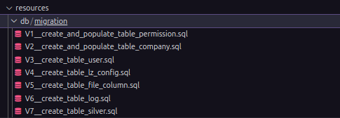
</div>
</details>
<details>
<summary>Utilização commons-csv</summary>
Implementei o algoritmo responsável pelo tratamento e validação de arquivos CSV, com o objetivo de aplicar as regras de negócio definidas para a etapa inicial do processo de envio de dados, conhecida como configuração da camada LZ (Landing Zone).
Esse algoritmo realiza diversas validações fundamentais logo após o upload do arquivo, incluindo:
<ul>
    <li>Verificação de linhas nulas no conteúdo do arquivo</li>
    <li>Identificação da presença de cabeçalho (header)</li>
    <li>Determinação do tipo do arquivo</li>
    <li>Identificação do separador utilizado (por exemplo: vírgula, ponto e vírgula, tabulação, etc.)</li>
</ul>
Essas verificações garantem que o arquivo esteja em conformidade com os padrões esperados antes de ser processado e persistido no sistema.
Após o envio do CSV, o sistema realiza a validação e retorna uma estrutura de dados contendo as principais informações do arquivo.
Além disso, após a conclusão do upload e processamento do CSV, todas as colunas extraídas do arquivo são automaticamente exibidas na interface, na seção "Configurar Colunas", permitindo ao usuário revisar, ativar/desativar e ajustar as propriedades de cada uma conforme necessário.
<div>
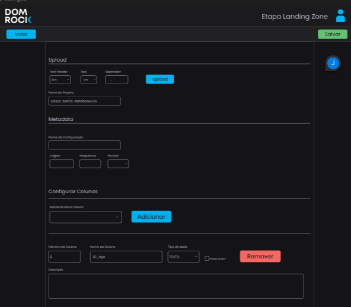
</div>
</details>
<details>
<summary>Criação da Tela Home</summary>
Implementei a tela Home do sistema, com o objetivo de organizar e controlar o acesso às diferentes rotas de configuração de acordo com o nível de permissão do usuário. Essa lógica é essencial para garantir que cada usuário só tenha acesso às etapas do pipeline de dados compatíveis com seu perfil de atuação, conforme definido pelas permissões atribuídas ao seu papel (role) no sistema.
A lógica de controle de acesso foi implementada com base na permissão (role) do usuário autenticado. A partir disso, defini as seguintes regras de navegação:
<ul>
    <li>
        Permissão LZ: o usuário poderá acessar exclusivamente a etapa de configuração da Landing Zone (LZ). As demais rotas (como Bronze e Silver) ficam automaticamente bloqueadas, impedindo o acesso a funcionalidades que não correspondem à sua permissão.
    </li>
    <li>
        Permissão Bronze: o usuário poderá acessar a configuração da camada Bronze.
    </li>
    <li>    
        Permissão Silver: o usuário poderá acessar a configuração da camada Silver
    </li>
</ul>        
A navegação foi construída de forma dinâmica, garantindo que os componentes de interface e as rotas visíveis sejam renderizados de acordo com a role do usuário logado,
além disso, segui o layout e os componentes definidos no Figma.
<div>
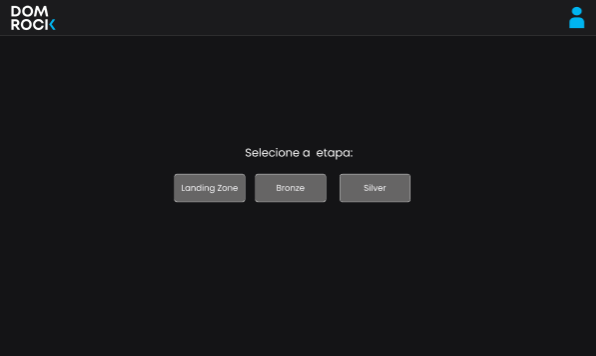
</div>
</details>
<details>
<summary>Criação da tela Bronze Config</summary>
Implementei a tela de configuração da etapa Bronze, seguindo as boas práticas de componentização e organização de interface. Durante o desenvolvimento, realizei o alinhamento dos componentes visuais e organizei a estrutura de forma hierárquica, garantindo que os componentes-pai fossem responsáveis por orquestrar os eventos e interações com os componentes-filho. Essa abordagem favorece a legibilidade do código, a reutilização de componentes e a manutenção futura da aplicação.
Cada componente foi projetado para ser responsável por uma funcionalidade específica, promovendo um desenvolvimento mais modular e desacoplado. Com isso, consegui separar claramente as responsabilidades, tornando a lógica de interação entre os elementos da interface mais simples e eficiente.
Na parte de integração com a API, utilizei a biblioteca Axios para realizar a requisição responsável por buscar as colunas validadas na etapa Silver.

Para essa tela foi adicionada a função de escolher quais colunas seriam hash para o arquivo.
<div>
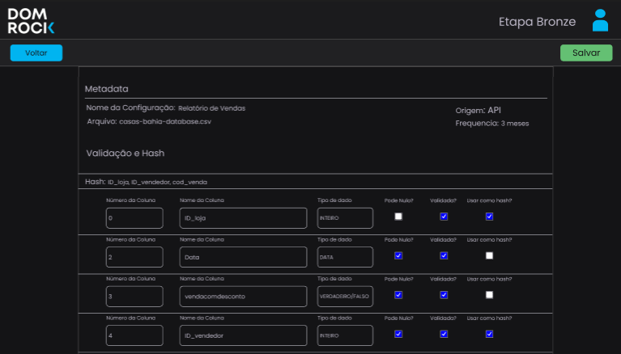
</div>
</details>
<details>
<summary>Criação da header da aplicação</summary>
Implementei o componente de Header da aplicação, com o objetivo de oferecer uma navegação mais intuitiva e fornecer informações contextuais importantes ao usuário durante o uso do sistema.
Esse componente reúne funcionalidades essenciais para a experiência do usuário, incluindo:
Indicação da etapa atual: exibe de forma clara em qual etapa do processo o usuário se encontra (por exemplo: Landing Zone, Bronze ou Silver), facilitando a orientação dentro do fluxo de configuração de dados.
<ul>
    <li>Identificação do usuário logado: apresenta o nome ou identificação do usuário atualmente autenticado no sistema.</li>
    <li>Botão de logout: permite que o usuário encerre sua sessão de forma rápida e segura, garantindo controle sobre o acesso ao sistema.</li>
    <li>Botões de ação "Salvar" e "Voltar": posicionados de forma estratégica no header, esses botões permitem ao usuário salvar as configurações atuais ou retornar à tela anterior, otimizando a navegação e o fluxo de trabalho.</li>
</ul>
<div>
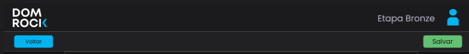
</div>
</details>
<details>
<summary>Criação da tela silver</summary>
Implementei a tela de configuração da etapa Silver (Silver Config), que tem como principal funcionalidade permitir ao usuário realizar o mapeamento de colunas através de um processo de "de/para", ou seja, definir um nome ou valor de destino para cada coluna validada nas etapas anteriores (Landing Zone e Bronze).
A interface foi construída de forma a facilitar a visualização e a associação entre os nomes originais das colunas e seus respectivos nomes padronizados, utilizados nas etapas seguintes do pipeline de dados
Durante o desenvolvimento, implementei a seguinte lógica:
<ul>
    <li>Busca de colunas validadas: a aplicação realiza uma requisição via API para recuperar todas as colunas que foram aprovadas nas etapas anteriores do fluxo.</li>
    <li>Associação "de/para": para cada coluna listada, o usuário pode informar um valor correspondente ao nome padronizado (o "para"). Essa associação é armazenada na configuração da etapa Silver</li>
    <li>Remoção de mapeamento: também criei a lógica que permite remover uma coluna do mapeamento, garantindo flexibilidade na edição e correção dos dados configurados.</li>
</ul>
<div>
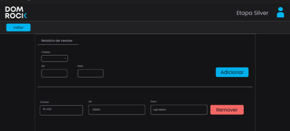
</div>
</details>
<details>
<summary>Cadastro de empresa</summary>
Implementei a tela de cadastro de empresa, com a pemissão de Admin é possivel realizar o cadastro de empresa para que assim seja possível possível atrelar as configurações pertencentes aas empresa.
Portanto para registrar uma nova empresa é preciso passar o nome da empresa e o CNPJ.
<div>
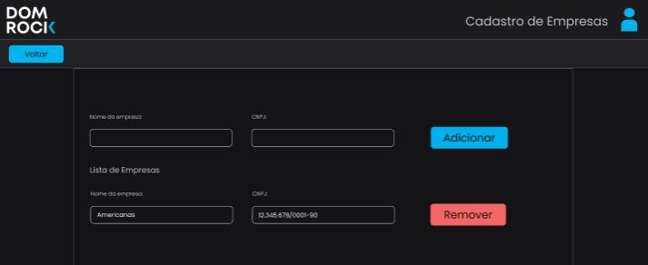
</div>
</details>
<details>
<summary>Login da aplicação</summary>
Implementei a tela de login da aplicação, responsável por autenticar o usuário e garantir o acesso seguro às funcionalidades do sistema.
A interface foi desenvolvida  permitindo que o usuário informe suas credenciais de forma prática. Após o envio dos dados, o sistema realiza a autenticação por meio de uma requisição à API, que retorna um token JWT (JSON Web Token) em caso de sucesso.
Para garantir a persistência da sessão e o controle de acesso às rotas protegidas, implementei a lógica de armazenamento do token no localStorage. Com isso:
O token fica disponível enquanto o usuário estiver logado.
<div>
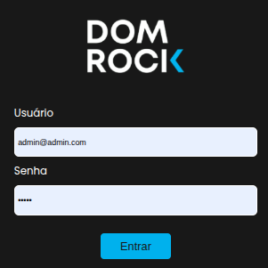
</div>
</details>
<br>

<h2>Hard Skills</h2>

Nome|Descrição|Nível
| :-------- | :-------- |:-------- |
|FlayWay|Utilizei o flay way para a automatização das migrations no nosso banco.|★★★★☆
|Vue|Utilizei o Vue para a criação dos componentes e das telas, organizando as rotas de forma estruturada e seguindo o padrão SPA (Single Page Application). Com HTML e CSS, consegui construir o corpo da aplicação e aplicar a estilização dos componentes. O Vue também me permitiu utilizar recursos reativos, deixando a aplicação mais dinâmica.|★★★☆☆
|Spring|Com o Spring Boot, consegui criar o endpoint responsável pelo tratamento do arquivo CSV. A aplicação recebe o arquivo por meio de um controller, que aciona um service responsável por processar o conteúdo e retornar os dados da configuração, juntamente com a lista de colunas relacionadas a esse projeto.|★★★☆☆
|JWT token|Na tela de login, realizei uma requisição para o backend enviando o username e a senha. Em caso de autenticação bem-sucedida, recebo um token, que é armazenado no localStorage, permitindo que o usuário tenha acesso às funcionalidades da aplicação de acordo com suas permissões.|★★★☆☆
|Axios| Utilizei a biblioteca Axios para realizar as chamadas dos métodos HTTP para a aplicação desenvolvida com Spring Boot, facilitando a comunicação entre o front-end e o back-end.|★★★☆☆


<h2>Soft Skills</h2>

Nome|Descrição|
| :-------- | :-------- |
|Agíl|Nesse projeto, atuei como Scrum Master, apoiando o time na aplicação prática da metodologia ágil. Minha atuação incluía o acompanhamento do andamento das tarefas, garantindo que os princípios do Scrum fossem seguidos de forma eficaz.Contribuí ativamente nas dailys, ajudando a torná-las mais objetivas e assertivas, com foco no progresso real das entregas e na remoção de impedimentos. Também fui responsável por organizar e conduzir os eventos de retrospectiva e planejamento (planning), incentivando a participação de todos os membros da equipe. Isso permitiu identificar pontos de melhoria e promover ajustes contínuos no processo.|
|Adaptabilidade| Nesse projeto, foi escolhida a utilização do framework Vue, com o qual eu ainda não tinha muita familiaridade. No entanto, busquei estudar e entender como ele funcionava, explorando sua estrutura e conceitos. Com esse esforço, consegui aprender rapidamente e implementar as funcionalidades necessárias para o andamento do projeto de forma eficaz.|
|Proatividade|Todos os dias eu acompanhava de perto o andamento do projeto e, sempre que identificava algo que pudesse estar atrapalhando o progresso, me colocava à disposição para ajudar a equipe. Atuava tanto no esclarecimento de dúvidas relacionadas a ferramentas ou regras de negócio, quanto assumindo tarefas de desenvolvimento quando necessário. Essa postura proativa contribuiu para manter o ritmo das entregas e fortalecer a colaboração dentro do time.|
|Planejamento|Durante uma sprint, o cliente solicitou uma alteração de última hora, destacando que era algo muito importante. No entanto, o time já estava com a capacidade comprometida, e todas as entregas da sprint haviam sido previamente definidas e alinhadas. Diante disso, assumi a responsabilidade de comunicar ao cliente que a alteração não seria implementada naquele momento.|

---

<h2 style="text-align: center;">Projeto: GEO- IOT (Quarto semestre 2024-2)</h2>

<h3>Empresa</h3>
Projeto executado em colaboração com a ITO1.

<h3>Problema</h3>
A IOT1 nos procurou com a necessidade de desenvolver uma aplicação robusta para processar um volume massivo de dados, que atinge a marca de aproximadamente 500.000 novas linhas (registros) relacionadas à geolocalização.
Este cenário impõe desafios críticos de armazenamento, escalabilidade e desempenho ao banco de dados

<h3>Objetivo da aplicação</h3>
O projeto tem como objetivo desenvolver uma solução robusta para o armazenamento e consulta de dados de geolocalização em tempo real, gerados por dispositivos IoT, como wearables, tags e smartphones. Utilizando um banco de dados SQL, ORACLE CLOUD, a solução será capaz de lidar com grandes volumes de dados, garantindo escalabilidade e alta disponibilidade. A arquitetura proposta envolve o uso de Spring Boot para o backend, Vue.js para o frontend e comunicação eficiente via APIs RESTful. A segurança dos dados será garantida com criptografia e controle de acesso.

<h3>Funcionalidade</h3>

<h4>API e Backend</h4>
<ul>
    <li>
        <strong>Autenticação e Autorização Robusta:</strong> Implementação de uma API com sistema de autenticação e autorização, garantindo diferentes níveis de acesso (Admin, Comum) e controle robusto a dados sensíveis.
    </li>
    <li>
        <strong>Gestão Completa de Recursos (CRUD):</strong> Entrega de endpoints para a criação, leitura, atualização e exclusão (CRUD) de recursos essenciais, como Usuários, Dispositivos IoT e Dados de Geolocalização.
    </li>
    <li>
        <strong>Serviços de Geolocalização:</strong> Desenvolvimento de endpoints dedicados para registro, consulta, rastreamento e histórico de dados de geolocalização. O banco de dados suporta o armazenamento de dados geoespaciais de múltiplos tipos de dispositivos IoT (wearables, tags, smartphones) e consultas espaciais eficientes.
    </li>
    <li>
        <strong>Mecanismo de Consultas Complexas:</strong> Implementação de mecanismos de consulta na API que suportam filtros avançados por tempo, localização e tipo de dispositivo, com geração de relatórios customizados.
    </li>
</ul>

<h4>Frontend e Interface do Usuário</h4>
<ul>
    <li>
        <strong>Filtros Avançados e Contextuais:</strong> Implementação de menus suspensos (dropdowns) para filtros refinados, incluindo: Tipo de Objeto (Pessoa, Veículo), Indivíduo/Objeto Específico, Origem do Dado (Wearables, Tags, Smartphones) e Período da Pesquisa (Data/Hora de Início e Fim).
    </li>
    <li>
        <strong>Pesquisa Rápida e Predefinida:</strong> Disponibilização de um campo de pesquisa rápida com filtros de tempo predefinidos (Ex: Hoje, Últimos 3 dias, Último mês) para acesso eficiente a resultados relevantes.
    </li>
    <li>
        <strong>Controle de Reprodução de Movimentação:</strong> Implementação de uma interface com controles para o usuário selecionar a velocidade de reprodução e navegar pelo histórico de movimentação (avançar/retroceder), visualizando pontos de parada e trajetórias em um intervalo de tempo específico.
    </li>
    <li>
        <strong>Visualização Geoespacial Completa:</strong> Implementação de um mapa interativo com funcionalidades básicas (arrasto e zoom) e a plotagem automática dos pontos de parada (com intervalo de 15 minutos) e a exibição da movimentação (trajetória) entre esses pontos.
    </li>
</ul>

Link da aplicação:<a href="https://github.com/manolito-fatec/geo-iot-2024-1">GEO-IOT</a>

<div style="text-align: center;">
    <b>Tecnologias Utilizadas no Projeto</b>
    <div>
        <a href="https://www.figma.com/pt-br/" target="_blank"></a>
        <a href="https://developer.mozilla.org/pt-BR/docs/Web/HTML" target="_blank"></a>
        <a href="https://developer.mozilla.org/pt-BR/docs/Web/CSS" target="_blank"></a>
        <a href="https://vuejs.org/" target="_blank"></a>
        <a href="https://www.typescriptlang.org/docs/handbook/2/objects.html" target="_blank"></a>
        <a href="https://git-scm.com/" target="_blank"></a>
        <a href="https://github.com/" target="_blank"></a>
        <a href="https://spring.io/projects/spring-boot" target="_blank"></a>
        <a href="https://docs.oracle.com/en/java/javase/17/" target="_blank"></a>
        <a href="https://maven.apache.org/" target="_blank"></a>
        <a href="https://www.oracle.com/br/cloud/" target="_blank"></a>
        <a href="https://redis.io/" target="_blank"></a>
        <a href="https://code.visualstudio.com/" target="_blank"></a>
        <a href="https://www.jetbrains.com/pt-br/idea/" target="_blank"></a>
        <a href="https://trello.com/" target="_blank"></a>
    </div>
</div>

Nome|Descrição|
 :--------: | :-------- |
|[FIGMA](https://www.figma.com/pt-br/)|O Figma foi a ferramenta central utilizada para a etapa de design de interface (UI) e planejamento da experiência do usuário (UX) do sistema.|
|[HTML](https://developer.mozilla.org/pt-BR/docs/Web/HTML)|A estrutura e o conteúdo das páginas web foram definidos utilizando a linguagem de marcação HTML (HyperText Markup Language).|
|[CSS](https://developer.mozilla.org/pt-BR/docs/Web/CSS)|A estilização, o design e o apresentação visual da página web foram definidos utilizando CSS (Cascading Style Sheets).|
|[VUE](https://vuejs.org/)|O framework Vue.js foi escolhido para o desenvolvimento frontend da aplicação. Ele foi implementado seguindo o padrão SPA (Single Page Application), facilitando a construção interativa das telas.|
|[TYPESCRIPT](https://www.typescriptlang.org/docs/handbook/2/objects.html)|O desenvolvimento front-end foi realizado utilizando a linguagem TypeScript para a codificação|.
|[GIT](https://git-scm.com/)|O Git foi a ferramenta padrão selecionada e utilizada para o versionamento e controle do código-fonte em nosso projeto|
|[GITHUB](https://github.com/)|O GitHub foi a plataforma escolhida para hospedar e gerenciar nosso repositório Git.|
|[SPRING-BOOT](https://spring.io/projects/spring-boot)| O framework Spring Boot foi adotado no back-end para facilitar a configuração e o desenvolvimento rápido da aplicação. A implementação seguiu o padrão de Arquitetura em Camadas|
|[JAVA](https://docs.oracle.com/en/java/javase/17/)|A linguagem Java foi utilizada para a implementação da regra do back-end do sistema|
|[MAVEN](https://maven.apache.org/)|O Maven foi adotado como ferramenta de gerenciamento de dependências para o projeto Java, facilitando a inclusão e o controle das bibliotecas externas.|
|[ORACLE-CLOUD](https://www.oracle.com/br/cloud/)|O Sistema Gerenciador de Banco de Dados (SGBD) utilizado foi o Oracle Database, hospedado na plataforma Oracle Cloud para maior escalabilidade e disponibilidade.|
|[REDIS](https://redis.io/)|O Redis foi empregado como um armazenamento em memória (in-memory data store) para implementar o mecanismo de cache da aplicação, melhorando o desempenho e reduzindo a latência.|
|[VSCODE](https://code.visualstudio.com/)|Utilizou-se o Visual Studio Code (VS Code) como editor de código-fonte durante o desenvolvimento|
|[INTELLIJ](https://www.jetbrains.com/pt-br/idea/)|Utilizou-se o IntelliJ como IDE para o JAVA.|
|[TRELLO](https://trello.com/)|O Trello foi a ferramenta utilizada para a gestão das tarefas, aplicando-se a metodologia Kanban para o acompanhamento dos cards.|


<br>
<h3>Contribuições Pessoais</h3>
Nessa aplicação, atuei como desenvolvedor back-end, sendo responsável pela criação de APIs, implementação de regras de negócio, integração com o banco de dados e suporte às funcionalidades necessárias para o funcionamento da aplicação.

<details>
<summary>Implementação do Redis</summary>
Como a aplicação lidava com um grande volume de dados, utilizamos o Redis para otimizar o desempenho, especialmente nos cálculos relacionados à movimentação de dispositivos IoT.
Para isso, configurei o Redis como um serviço no docker-compose, permitindo o uso de armazenamento em cache. Essa abordagem foi essencial para reduzir o tempo de resposta das operações e aliviar a carga sobre o banco de dados principal.
Implementei um controller específico para gerenciar o cache, que fazia chamadas a um service responsável por armazenar e recuperar os dados no Redis
<div>
    <b>docker-compose.yaml</b>
    <div>
    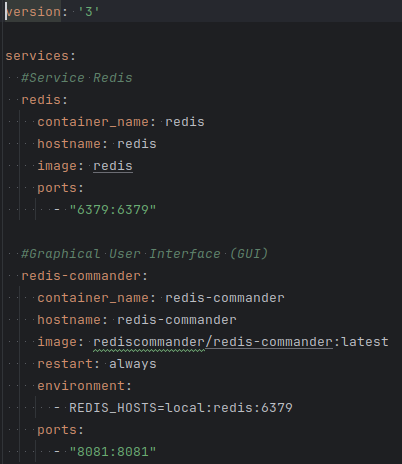
    </div>
    <b>Método para armazinar no cache</b>
    <div>
    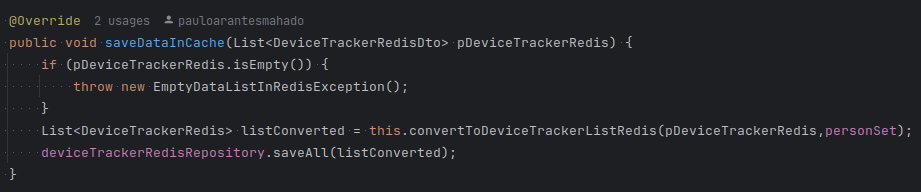
    </div>
</div>    
</details>
<details>
<summary>Criação de Exceptions personalizadas</summary>
Implementei algumas exceptions personalizadas para melhorar o tratamento de erros na aplicação. Com essas customizações, foi possível exibir mensagens mais claras e específicas, facilitando a visualização, identificação e correção dos erros.
<div>
    <b>Exemplo:</b>
    <div>
    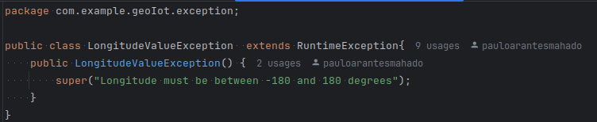
    </div>
</div>    
</details>
<details>
<summary>Criação da Entidade Person</summary>
Implementei a entidade Person (representando as pessoas que possuem dispositivos IoT), realizando o mapeamento com a base de dados por meio de JPA. Desenvolvi todo o CRUD da entidade, incluindo validações nos campos obrigatórios e uma verificação adicional para garantir que a pessoa ainda não estivesse cadastrada no banco de dados, evitando duplicidades.
<div>
    <b>Exemplo:</b>
    <div>
    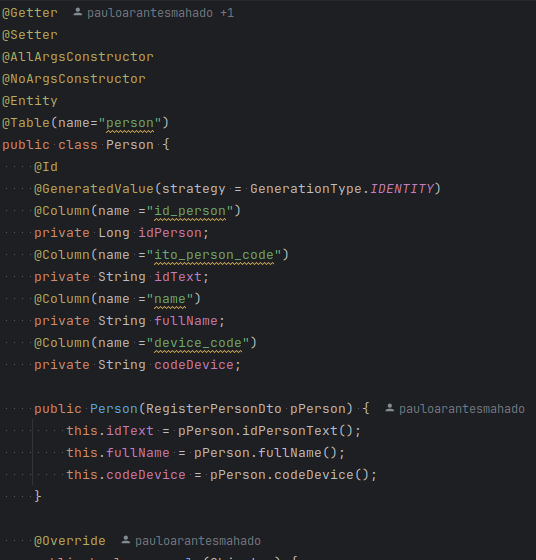
    </div>
</div>    
</details>
<details>
<summary>Criação do algoritmo de Parada</summary>
Implementei um algoritmo de detecção de paradas baseado em dados de localização. A lógica realizava a paginação dos registros no banco de dados em blocos de 100 pontos, analisando cada ponto individualmente. Caso fosse detectado que o usuário permaneceu dentro de um raio de até 5 metros, essa condição era considerada uma parada. Cada parada identificada era encapsulada em um objeto StopDto e adicionada a uma lista, que posteriormente era enviada ao front-end para exibição.
<div>
    <b>StopDto:</b>
    <div>
    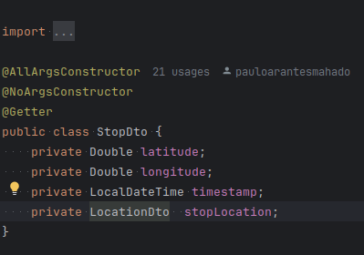
    </div>
</div>    
</details>
<details>
<summary>Device tracker : registro de pontos</summary>
Implementei uma validação para o registro de pontos geográficos no banco de dados, garantindo a integridade das informações. As validações incluíam a verificação de valores nulos, bem como a checagem se a latitude estava entre -90 e 90 graus e a longitude entre -180 e 180 graus. Além disso, utilizei os valores de latitude e longitude válidos para obter o endereço correspondente.
<div>
    <b>StopDto:</b>
    <div>
    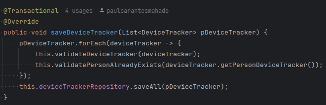
    </div>
</div>    
</details>
<details>
<summary>Histórico</summary>
Implementei uma validação que garante que cada pessoa que possua registros no DeviceTracker consiga acessar e visualizar seu histórico completo de movimentações em um certo período. Esse histórico é composto por um conjunto organizado de paradas detectadas ao longo do tempo, que representam momentos em que o dispositivo permaneceu estacionado por determinado período. Com base nessas informações, o sistema consegue identificar e reconstruir as viagens realizadas pelo usuário, apresentando-as de forma clara e estruturada.
<div>
    <b>Método de histórico:</b>
    <div>
    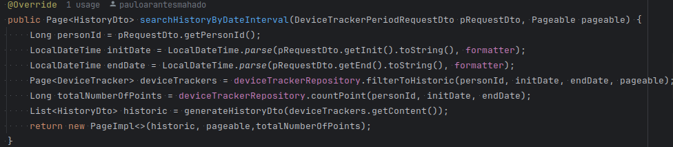
    </div>
</div>
</details>
<details>
<summary>Spring Batch</summary>
Implementei o framework Spring Batch para otimizar o processamento de grandes volumes de dados na nossa aplicação. Antes da implementação, a leitura, validação e gravação de arquivos CSV com mais de 500.000 linhas demorava cerca de 7 horas para ser concluída, impactando negativamente o desempenho e a experiência do usuário.
Com o uso do Spring Batch, criei três jobs distintos: um para a leitura do arquivo, outro para a validação dos dados e um terceiro para o registro dessas informações no banco de dados. Essa divisão permitiu a execução eficiente das etapas em paralelo e com melhor gerenciamento de recursos.
Como resultado, consegui reduzir o tempo total de processamento para aproximadamente 5 minutos.
<div>
    <b>Metodo padrão de tratamento para csv:</b>
    <div>
    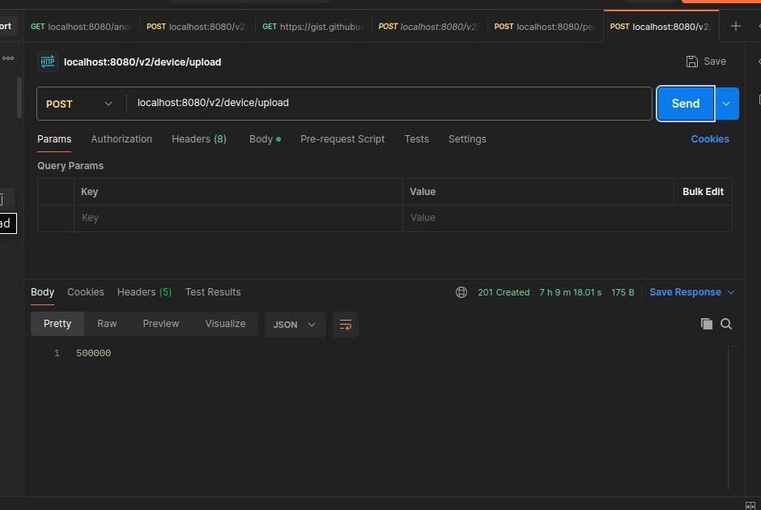
    </div>
    <b>Spring Batch:</b>
    <div>
    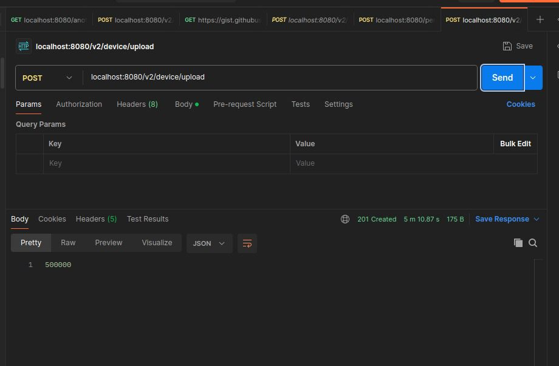
    </div>
</div>
</details>
<br>

<h2>Hard Skills</h2>

Nome|Descrição|Nível
| :-------- | :-------- |:-------- |
|Spring-Batch|Com o Spring Batch, implementei um step responsável pela leitura, validação e escrita de dados no banco de forma muito mais performática. Essa abordagem permitiu o processamento eficiente de arquivos CSV com grandes volumes de dados. Antes da adoção do Spring Batch, o tempo de inserção no banco chegava a aproximadamente 7 horas. Após a reestruturação utilizando esse framework, consegui reduzir o tempo de processamento para cerca de 5 minutos.|★★★★☆|
|Spring-JPA|Com o spring JPA eu mapeie um entitade de Person e criei um repository que implementa a inteface JapaRepository que posssui os metodos pontos de crud, porém também crei outros metodos para realizar um filtragem.|★★★★★|
|Redis| Utilizei o Redis como banco de dados em cache para aumentar a velocidade no cálculo de paradas com base nos dados de localização. Ao armazenar temporariamente as informações em memória, foi possível reduzir significativamente o tempo de acesso e processamento.|★★★☆☆
|Docker-Compose| Utilizei o Docker Compose para configurar e executar um serviço do Redis, além de incluir uma interface gráfica, para consultas no redis.|★★★★★|
|Oracle-Cloud|Criamos um banco de dados na Oracle Cloud com o objetivo de centralizar as consultas e o armazenamento de dados do projeto.|★★★★☆|
|Test unitários|Adotamos a prática de testes unitários na aplicação, o que contribuiu significativamente para a redução de bugs durante o desenvolvimento.|★★★★☆|


<h2>Soft Skills</h2>

Nome|Descrição|
| :-------- | :-------- |
|Aprendizado contínuo|Nesse projeto tive que buscar studar e entender novas tecnologias as quais eu nunca tinha trabalahdo, portanto me dediquei e conseguir atribuir essa ferramentas a aplicação.|
|Proatividade| Fui proativo ao assumir tarefas que apresentavam um maior grau de complexidade, demonstrando iniciativa e disposição para enfrentar desafios. Além disso, contribuí ativamente com o time, oferecendo suporte a colegas que estavam com dificuldades técnicas ou enfrentando obstáculos nas suas tarefas.|
|Pensamento crítico|Durante o projeto, percebi que diversas informações descritas na documentação inicial repassada pelo cliente, no kick-off, acabavam fugindo do escopo ou não faziam sentido técnico dentro da proposta da solução. Com base nisso, sempre busquei analisar com cuidado essas demandas e conversei com o PO para propor ajustes ou abordagens mais coerentes. Essa postura ajudou a evitar retrabalho e garantiu que as implementações estivessem alinhadas com os objetivos reais do projeto.|

---

<h2 style="text-align: center;">Projeto: YOUTAN DASH (Quinto semestre 2025-1)</h2>

<h3>Empresa</h3>
Projeto executado em colaboração com a YOUTAN.

<h3>Problema</h3>
Com o aumento da demanda por projetos, a liderança passou a enfrentar dificuldades para obter visibilidade clara sobre o andamento das iniciativas. As métricas disponíveis nos tickets da ferramenta de gestão Taiga não estavam sendo consolidadas ou apresentadas de forma acessível, dificultando o acompanhamento do desempenho, identificação de gargalos e tomada de decisões estratégicas.

<h3>Objetivo da aplicação</h3>
O objetivo do projeto é desenvolver uma plataforma integrada a ferramenta de gestão de projetos Taiga, com o intuito de gerar e visualizar indicadores relacionados ao andamento de projetos. A plataforma deve fornecer um dashboard que permita a extração e análise de métricas importantes, como a quantidade de cards criados e finalizados em um período, tempo médio de execução de cards, distribuição de cards por colaborador, e outros indicadores relevantes para a gestão de projetos. A plataforma deve oferecer diferentes níveis de acesso para usuários, como Operador, Gestor e Admin, garantindo que cada perfil tenha acesso apenas às informações pertinentes ao seu papel. O projeto visa facilitar a visualização e o monitoramento do progresso dos projetos, tornando o processo mais eficiente, transparente e acessível para todos os envolvidos.

<h3>Funcionalidades</h3>

<h4>Para Operadores (Foco em Desempenho Pessoal)</h4>
<ul>
  <li>Visualização de todos os cards organizados por status (pendente, em progresso, finalizado) para acompanhamento do andamento das tarefas.</li>
  <li>Visualização do tempo médio de conclusão dos cards finalizados e da quantidade de projetos em que o operador participa, para monitoramento de eficiência.</li>
</ul>

<h4>Para Gestores (Foco em Produtividade e Monitoramento de Equipe)</h4>
<ul>
  <li>Visualização da quantidade de cards atribuídos a cada operador sob gestão, além dos cards designados ao próprio gestor.</li>
  <li>Capacidade de filtrar cards de projetos sob sua gestão (e atribuídos a ele) por um período específico, facilitando o acompanhamento da evolução.</li>
  <li>Visualização de todos os cards dos operadores gerenciados, com filtro baseado no status da tarefa, para monitorar o progresso dos projetos.</li>
  <li>Apresentação de indicadores sobre o tempo médio de conclusão dos cards finalizados pela equipe e o tempo médio individual de cada operador.</li>
  <li>Visualização de informações detalhadas sobre retrabalhos e issues (quantidade, tipo, gravidade e prioridade) para análise de eficiência e priorização de ações corretivas.</li>
  <li>Funcionalidade para visualizar o total de cards organizados por tags, otimizando a análise da distribuição e progresso das tarefas por área do projeto.</li>
</ul>

<h4>Para Administradores (Foco em Governança e Estrutura)</h4>
<ul>
  <li>Visualização da quantidade total de projetos e cards em cada um, fornecendo uma visão abrangente da gestão.</li>
  <li>Visualização da quantidade de cards criados e finalizados dentro de um período específico para monitorar o progresso global.</li>
  <li>Tabela com a listagem de cada projeto, o gestor responsável e o número de pessoas alocadas, para uma visão clara da estrutura.</li>
  <li>Funcionalidade de exportação dos dados do Dashboard para arquivo CSV, permitindo análise, compartilhamento e arquivamento externo.</li>
  <li>Tabela abrangente de registro de auditoria que detalha cada ação realizada na aplicação (usuário, tipo de ação e timestamp).</li>
  <li>Funcionalidade para o Admin cadastrar novos usuários, com a obrigatoriedade de associar o usuário a, no mínimo, uma ferramenta de gestão (Taiga, Trello ou Jira) para fins de integração.</li>
  <li>Capacidade de o Admin integrar novas ferramentas ao sistema, permitindo a ampliação de funcionalidades e interoperabilidade.</li>
</ul>

<h4>Funcionalidade Geral</h4>
<ul>
  <li>Implementação do sistema de autenticação na aplicação, permitindo acesso seguro aos indicadores e dados relevantes (para Operador, Gestor e Admin).</li> 
</ul>

Link da aplicação:<a href="https://github.com/manolito-fatec/dashflow-2025-1">YOUTAN DASH</a>

<div style="text-align: center;">
    <b>Tecnologias Utilizadas no Projeto</b>
    <div>
        <a href="https://www.figma.com/pt-br/" target="_blank"></a>
        <a href="https://developer.mozilla.org/pt-BR/docs/Web/HTML" target="_blank"></a>
        <a href="https://developer.mozilla.org/pt-BR/docs/Web/CSS" target="_blank"></a>
        <a href="https://vuejs.org/" target="_blank"></a>
        <a href="https://www.typescriptlang.org/docs/handbook/2/objects.html" target="_blank"></a>
        <a href="https://git-scm.com/" target="_blank"></a>
        <a href="https://github.com/" target="_blank"></a>
        <a href="https://spring.io/projects/spring-boot" target="_blank"></a>
        <a href="https://docs.oracle.com/en/java/javase/17/" target="_blank"></a>
        <a href="https://maven.apache.org/" target="_blank"></a>
        <a href="https://vercel.com/" target="_blank"></a>
        <a href="https://www.oracle.com/br/cloud/" target="_blank"></a>
        <a href="https://www.red-gate.com/products/flyway/community/" target="_blank"></a>
        <a href="https://spark.apache.org/" target="_blank"></a>
        <a href="https://taiga.io/" target="_blank"></a>
        <a href="https://code.visualstudio.com/" target="_blank"></a>
        <a href="https://www.jetbrains.com/pt-br/idea/" target="_blank"></a>
        <a href="https://junit.org/junit5/" target="_blank"></a>
        <a href="https://site.mockito.org/" target="_blank"></a>
        <a href="https://vitest.dev/" target="_blank"></a>
        <a href="https://swagger.io/" target="_blank"></a>
    </div>
</div>

Nome|Descrição|
 :--------: | :-------- |
|[FIGMA](https://www.figma.com/pt-br/)|O Figma foi a ferramenta central utilizada para a etapa de design de interface (UI) e planejamento da experiência do usuário (UX) do sistema.|
|[HTML](https://developer.mozilla.org/pt-BR/docs/Web/HTML)|A estrutura e o conteúdo das páginas web foram definidos utilizando a linguagem de marcação HTML (HyperText Markup Language).|
|[CSS](https://developer.mozilla.org/pt-BR/docs/Web/CSS)|A estilização, o design e o apresentação visual da página web foram definidos utilizando CSS (Cascading Style Sheets).|
|[VUE](https://vuejs.org/)|O framework Vue.js foi escolhido para o desenvolvimento frontend da aplicação. Ele foi implementado seguindo o padrão SPA (Single Page Application), facilitando a construção interativa das telas.|
|[TYPESCRIPT](https://www.typescriptlang.org/docs/handbook/2/objects.html)|O desenvolvimento do front-end foi realizado utilizando a linguagem TypeScript como principal ferramenta de codificação.|
|[GIT](https://git-scm.com/)|O Git foi a ferramenta padrão selecionada e utilizada para o versionamento e controle do código-fonte em nosso projeto.|
|[GITHUB](https://github.com/)|O GitHub foi a plataforma escolhida para hospedar e gerenciar nosso repositório Git.|
|[SPRING-BOOT](https://spring.io/projects/spring-boot)|O framework Spring Boot foi adotado no back-end para facilitar a configuração e o desenvolvimento rápido da aplicação. A implementação seguiu o padrão de Arquitetura em Camadas.|
|[JAVA](https://docs.oracle.com/en/java/javase/17/)|A linguagem Java foi utilizada para o desenvolvimento do back-end da aplicação.|
|[MAVEN](https://maven.apache.org/)|O Maven foi adotado como ferramenta de gerenciamento de dependências para o projeto Java, facilitando a inclusão e o controle das bibliotecas externas.|
|[VSCODE](https://code.visualstudio.com/)|Utilizou-se o Visual Studio Code (VS Code) como editor de código-fonte durante o desenvolvimento|
|[INTELLIJ](https://www.jetbrains.com/pt-br/idea/)|Utilizou-se o IntelliJ como IDE para o JAVA.|
|[VERCEL](https://vercel.com/)|A plataforma Vercel foi utilizada para realizar a implantação (deploy) e a hospedagem da página de análise de requisitos.|
|[ORACLEDB](https://www.oracle.com/br/cloud/)|O Oracle Database foi o Sistema Gerenciador de Banco de Dados (SGBD) escolhido para garantir a persistência e a segurança dos dados da aplicação.|
|[FLYWAY](https://www.red-gate.com/products/flyway/community/)|Utilizou-se o Flyway para gerar as migrations e versionar o banco de dados.|
|[APACHESPARK](https://spark.apache.org/)|Utilizamos o poder de processamento do Apache Spark para extrair, transformar e carregar (ETL) os dados obtidos da API do Taiga, preparando-os para análise.|
|[TAIGA](https://taiga.io/)|A plataforma Taiga foi utilizada para o gerenciamento ágil do projeto, incluindo o acompanhamento das User Stories (US) e das tarefas associadas.|
|[JUNIT](https://junit.org/junit5/)|O framework JUnit foi empregado para a criação e execução de testes unitários com o objetivo de validar algumas das regras de negócio mais críticas do sistema.|
|[MOCKITO](https://site.mockito.org/)|A ferramenta Mockito foi adotada para a criação de mocks, garantindo o isolamento adequado durante os testes.|
|[VITEST](https://vitest.dev/)|O framework Vitest foi utilizado para a criação e execução de testes unitários no front-end.|
|[SWAGGER-DOC](https://swagger.io/)|A ferramenta Swagger (OpenAPI Specification) foi utilizada para documentar a API.|


<br>
<h3>Contribuições Pessoais</h3>
Nessa aplicação, atuei como Product Owner (PO) e também como responsável pela etapa de testes na esteira DevOps. Nesse papel, trabalhei junto ao time para identificar as principais dores do cliente e traduzi-las em requisitos claros, garantindo uma boa rastreabilidade ao longo do desenvolvimento. Além disso, elaborei um documento de apoio para orientar a equipe na criação dos testes unitários, contribuindo para a padronização e a qualidade das entregas.
<details>
<summary>Rastreamento de requisitos</summary>
Após o kick-off, analisei o documento de requisitos para compreender melhor as funcionalidades que poderíamos implementar. Em seguida, mantive contato constante com o cliente para validar essas ideias. Como o cliente não tinha um perfil técnico, optei por apresentar as funcionalidades por meio de um protótipo que desenvolvi no Figma, facilitando o entendimento.
Depois da definição dos requisitos, criei identificadores únicos para cada um deles, garantindo uma rastreabilidade mais eficiente ao longo do projeto. Além disso, desenvolvi uma página web demonstrando o fluxo de rastreamento de requisitos, ajudando o time a visualizar e acompanhar o processo de forma clara e organizada.
<a href="https://youtan-req.vercel.app/#Introduction">Página de requisitos</a>
<div>
    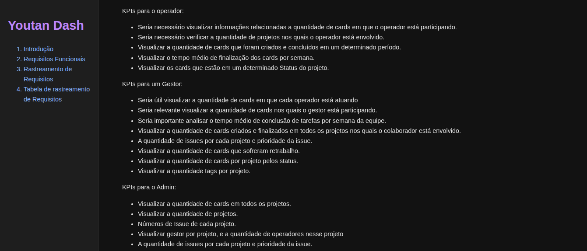
</div>
</details>
<details>
<summary>Comunicação com o cliente</summary>
Mantive contato constante com o cliente para coletar feedbacks das entregas e validar as funcionalidades do produto. Sempre procurei apresentar o projeto de forma simples e visual, facilitando a compreensão do cliente sobre o que estava sendo desenvolvido.
A comunicação com o cliente era feita principalmente pelo Slack. Além disso, realizava reuniões semanais com o time para verificar se todos tinham um entendimento claro das funcionalidades e das tarefas em andamento, além de levantar possíveis dúvidas ou pontos a serem esclarecidos com o cliente.
</details>
<details>
<summary>Backlog</summary>
Fui responsável pela criação e gerenciamento do ciclo de vida do Product Backlog e do Sprint Backlog.
No Product Backlog, organizei as user stories por prioridade, defini em qual sprint cada uma seria implementada e associei os requisitos funcionais correspondentes, garantindo o fluxo correto de rastreabilidade dos requisitos.
Além disso, trabalhei junto ao time na definição do DOD (Definition of Done) e do DOR (Definition of Ready) para cada user story, assegurando clareza e alinhamento sobre o que precisava ser entregue e quando uma tarefa estava pronta para ser iniciada.
</details>
<details>
<summary>Test Unitários</summary>
Fui responsável pelos testes unitários do projeto, tanto no back-end quanto no front-end. Elaborei um documento detalhado explicando, passo a passo, como os testes deveriam ser implementados.
No back-end, os testes foram criados com foco na validação das regras de negócio dentro da camada de service da aplicação. Já no front-end, os testes tinham como objetivo verificar o comportamento dos inputs e demais interações da interface.
O documento também apresentava o padrão de criação dos testes, incluindo orientações sobre nomenclatura e estrutura do corpo de cada teste, servindo como guia para manter a padronização e a qualidade do código.
</details>
<details>
<summary>Componente exportar Dados</summary>
Desenvolvi uma funcionalidade para exportar os dados do dashboard em formato CSV, implementando toda a solução desde a criação do endpoint no back-end até o desenvolvimento do componente na interface responsável por executar a exportação.
<div>
    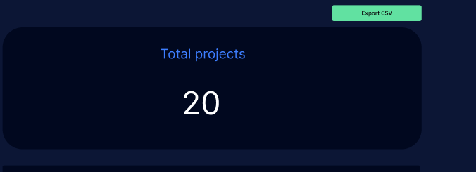
</div>
</details>
<br>

<h2>Hard Skills</h2>

Nome|Descrição|Nível
| :-------- | :-------- |:-------- |
|Figma| Utilizei o Figma para criar o protótipo da aplicação, desenvolvendo mockups das telas e componentes para facilitar a implementação pelo time de front-end. Além disso, os protótipos foram essenciais para apresentar e validar as funcionalidades com o cliente, tornando o entendimento do produto mais claro e visual.|★★★★★|
|Vercel|Utilizei o Vercel para realizar o deploy da página web, tornando a documentação de rastreamento de requisitos mais acessível e fácil de consultar para toda a equipe.|★★★★★|
|Test unitários|Testes unitários (JUnit, Mockito, Vitest) Criação e documentação de testes para validação de regras de negócio e interações de interface.|★★★★☆|


<h2>Soft Skills</h2>

Nome|Descrição|
| :-------- | :-------- |
|Comunicação |Sempre busquei manter uma comunicação clara e constante com o cliente, validando funcionalidades e coletando feedbacks sobre o produto. Também tive o cuidado de transmitir essas informações ao time de forma objetiva, garantindo o entendimento de todos sobre as demandas. Além disso, prezei pela transparência em todas as interações, compartilhando o andamento das tarefas e informando prontamente o cliente em caso de qualquer imprevisto.|
|Proatividade| Fui proativo em auxiliar meus colegas em tarefas relacionadas ao produto e à implementação da esteira DevOps. Desenvolvi uma página de análise de requisitos para facilitar o entendimento do processo e apoiar o time na execução dessas atividades.|

---

<h2 style="text-align: center;">Projeto: PARDAL - Insights e Metricas de Tickets de chamados de suporte (Sexto semestre 2025-2)</h2>

<h3>Empresa</h3>
Projeto executado em colaboração com a Pro4tec.

<h3>Problema</h3>
A Pro4tec enfrentava a necessidade de modernizar sua base histórica de tickets de suporte. O problema se dividia em duas frentes principais:
<ul>
<li>Segurança e Conformidade: Garantir a segurança e o tratamento adequado das informações dos clientes, alinhando a gestão de dados antigos à LGPD (Lei Geral de Proteção de Dados).</li>
<li>Inteligência de Gestão: Desenvolver capacidades de visualização e análise (business intelligence) para extrair insights dos dados, o que permitiria um gerenciamento mais eficiente e estratégico dos tickets de suporte.</li>
</ul>

<h3>Funcionalidades</h3>
<ul>
  <li>Funcionalidade implementada para geração periódica e segura de backups do sistema e da base de dados, garantindo a recuperação em caso de falhas.</li>
  <li>Funcionalidades de criação, edição e remoção de usuários concluídas, mantendo o acesso ao sistema atualizado.</li>
  <li>Funcionalidade de exportação de relatórios em formatos PDF e CSV, permitindo o compartilhamento de resultados com outros departamentos.</li>
  <li>Implementado um processo automatizado que analisa o texto dos tickets, extrai sugestões e as agrupa por tema.</li>
  <li>Funcionalidade para filtrar insights por cliente, produto e data.</li>
  <li>Dashboard com a visualização de insights prescritivos gerados por IA.</li>
  <li>Funcionalidade para visualizar a previsão de tickets sob risco de extrapolar o SLA.</li>
  <li>Módulo para identificar e listar as causas-raiz mais comuns dos tickets</li>
  <li>Funcionalidade para analisar a sazonalidade e o volume de tickets ao longo do tempo.</li>
  <li>Implementado o processo de anonimização automática de dados pessoais genéricos presentes nas descrições dos tickets, garantindo a conformidade com a LGPD.</li>
  <li>Implementação da tela onde o usuário pode visualizar suas informações, realizar a alteração de senha e exportar logs de acesso.
  </li>
  <li>Implementação do endpoint para criação de termo de uso</li>
</ul>

<h3>Objetivo da aplicação</h3>
O propósito essencial deste projeto é tratar e modernizar a base de dados legada do cliente, que armazena informações de tickets de suporte, visando a estrita conformidade com a LGPD. Além da adequação legal e segurança dos dados, a aplicação incorporará inteligência artificial (IA) para gerar métricas e insights.

Link da aplicação:<a href="https://github.com/manolito-fatec/pardal-2025">PARDAL - Insights e Metricas de Tickets de chamados de suporte</a>

<div style="text-align: center;">
    <b>Tecnologias Utilizadas no Projeto</b>
    <div>
        <a href="https://developer.mozilla.org/pt-BR/docs/Web/HTML" target="_blank"></a>
        <a href="https://developer.mozilla.org/pt-BR/docs/Web/CSS" target="_blank"></a>
        <a href="https://vuejs.org/" target="_blank"></a>
        <a href="https://www.typescriptlang.org/docs/handbook/2/objects.html" target="_blank"></a>
        <a href="https://yarnpkg.com/" target="_blank"></a>
        <a href="https://git-scm.com/" target="_blank"></a>
        <a href="https://github.com/" target="_blank"></a>
        <a href="https://spring.io/projects/spring-boot" target="_blank"></a>
        <a href="https://docs.oracle.com/en/java/javase/17/" target="_blank"></a>
        <a href="https://maven.apache.org/" target="_blank"></a>
        <a href="https://code.visualstudio.com/" target="_blank"></a>
        <a href="https://eclipseide.org/" target="_blank"></a>
        <a href="https://www.docker.com/" target="_blank"></a>
        <a href="https://www.python.org/" target="_blank"></a>
        <a href="https://pandas.pydata.org/" target="_blank"></a>
        <a href="https://www.kaggle.com/" target="_blank"></a>
        <a href="https://duckdb.org/" target="_blank"></a>
        <a href="https://www.postgresql.org/" target="_blank"></a>
        <a href="https://www.mongodb.com/" target="_blank"></a>
        <a href="https://taiga.io/" target="_blank"></a>
        <a href="https://www.red-gate.com/products/flyway/community/" target="_blank"></a>
        <a href="https://sonarcloud.io/login" target="_blank"></a>
        <a href="https://jupyter.org/" target="_blank"></a>
        <a href="https://swagger.io/" target="_blank"></a>
        <a href="https://www.vaultproject.io/" target="_blank"></a>
   </div>
</div>

Nome|Descrição|
 :--------: | :-------- |
|[HTML](https://developer.mozilla.org/pt-BR/docs/Web/HTML)|A estrutura e o conteúdo das páginas web foram definidos utilizando a linguagem de marcação HTML (HyperText Markup Language).|
|[CSS](https://developer.mozilla.org/pt-BR/docs/Web/CSS)|A estilização, o design e o apresentação visual da página web foram definidos utilizando CSS (Cascading Style Sheets).|
|[VUE](https://vuejs.org/)|Vue.js é um framework JavaScript de código aberto e progressivo usado para construir interfaces de usuário e aplicações web. Ele é conhecido por ser fácil de aprender e integrar em projetos existentes.|
|[TYPESCRIPT](https://www.typescriptlang.org/docs/handbook/2/objects.html)|O desenvolvimento do front-end foi realizado utilizando a linguagem TypeScript como principal ferramenta de codificação.|
|[YARN](https://yarnpkg.com/)|O gerenciador de pacotes Yarn foi utilizado para controlar as dependências e bibliotecas do projeto front-end|
|[GIT](https://git-scm.com/)|O Git foi a ferramenta padrão selecionada e utilizada para o versionamento e controle do código-fonte em nosso projeto.|
|[GITHUB](https://github.com/)|O Git foi a ferramenta padrão selecionada e utilizada para o versionamento e controle do código-fonte em nosso projeto.|
|[SPRING-BOOT](https://spring.io/projects/spring-boot)|O framework Spring Boot foi adotado no back-end para facilitar a configuração e o desenvolvimento rápido da aplicação. A implementação seguiu o padrão de Arquitetura em Camadas|
|[JAVA](https://docs.oracle.com/en/java/javase/17/)|A linguagem Java foi utilizada para o desenvolvimento do back-end da aplicação.|
|[MAVEN](https://maven.apache.org/)|O Maven foi adotado como ferramenta de gerenciamento de dependências para o projeto Java, facilitando a inclusão e o controle das bibliotecas externas.|
|[VSCODE](https://code.visualstudio.com/)|Utilizou-se o Visual Studio Code (VS Code) como editor de código-fonte durante o desenvolvimento.|
|[ECLIPSE](https://eclipseide.org/)|Eclipse foi utilizado como ide para o java no back-end|
|[DOCKER](https://www.docker.com/)|O Docker foi utilizado para a geração de imagens e contêineres dos seguintes serviços: PostgreSQL, MongoDB, o processo de ETL em Python e o Vault.|
|[PYTHON](https://www.python.org/)|O Python foi essencial para as atividades de Engenharia de Dados (processos de ETL) e para a Ciência de Dados (criação de modelos de Machine Learning).|
|[PANDAS](https://pandas.pydata.org/)|A biblioteca Pandas foi empregada nas etapas de pré-processamento e manipulação do dataset|
|[KAGGLE](https://www.kaggle.com/)|Utilizamos os Kaggle para utilizarmos o dataset para o treinamento de IA('Séries Temporais')|
|[DUNCKDB](https://duckdb.org/)|Empregamos o DuckDB para realizar a conexão e consulta de dados de forma rápida e eficiente dentro do processo de back-end da aplicação.|
|[POSTGRESQL](https://www.postgresql.org/)|Adotamos o PostgreSQL como nosso SGBD relacional, responsável pelo armazenamento seguro e pela integridade dos dados.|
|[MONGODB](https://www.mongodb.com/)|Utilizamos o MongoDB para o armazenamento dos logs da aplicação e para a persistência dos valores gerados pelos modelos de Machine Learning.|
|[TAIGA](https://taiga.io/)|A plataforma Taiga foi utilizada para o gerenciamento ágil do projeto, incluindo o acompanhamento das User Stories (US) e das tarefas associadas.|
|[FLYWAY](https://www.red-gate.com/products/flyway/community/)|Utilizou-se o Flyway para gerar as migrations e versionar o banco de dados.|
|[SONAR-CLOUD](https://sonarcloud.io/login)|O SonarCloud foi empregado para revisão automatizada do código, visando a melhoria da qualidade e a correção de problemas de segurança.|
|[JUPYTER](https://jupyter.org/)|O Jupyter foi empregado como o ambiente interativo principal para a execução e o monitoramento de todas as etapas do processo de treinamento do modelo de Inteligência Artificial (IA)|
|[SWAGGER-DOC](https://swagger.io/)|A ferramenta Swagger (OpenAPI Specification) foi utilizada para documentar a API.|
|[VAULT](https://developer.hashicorp.com/vault)|O Vault foi incorporado à aplicação para atuar como nosso serviço de gerenciamento de segredos. Ele centraliza e protege as chaves e hashes de cada usuário, assegurando que as credenciais sejam acessadas de forma segura e controlada, minimizando riscos de exposição.|


<br>
<h3>Contribuições Pessoais</h3>
Atuei de forma multifuncional neste projeto, englobando desde a infraestrutura de dados até a experiência do usuário e a inteligência artificial. Como desenvolvedor Full Stack (Back-end e Front-end), fui responsável pela criação de diversos endpoints de API, desenvolvimento de telas e componentes front-end, e pela lógica de negócios como a implementação de triggers no banco e a criação da lógica do Termo de Uso. Paralelamente, estruturei a base para Machine Learning, desenvolvendo um modelo de treinamento com forecaster e configurando o pipeline de extração e preparação dos dados necessários. Adicionalmente, fui responsável pelo gerenciamento dos logs da aplicação

<details>
<summary>Endpoint de buscas de dados relacionados a Tela de dashboards</summary>
UUtilizando a JPA Criteria API, a consulta de busca foi aprimorada para ser dinâmica, facilitando a implementação de filtros complexos e melhorando a flexibilidade nas operações de busca de dados.
Adicionalmente, criei uma endpoint para buscar informações sobre o indicador de % de Reincidência.
<div>
    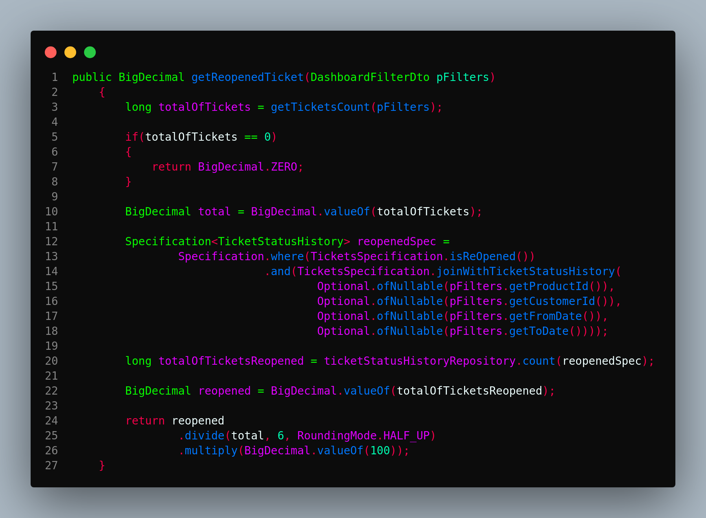
</div>
</details>
<details>
<summary>Criação do modelo de machine learrning usuando um data set do Kaggle</summary>
Utilizando um dataset do Kaggle, desenvolvi um modelo de Machine Learning para séries temporais baseado no Prophet (treinado em Jupyter Notebook) com o objetivo de prever a quantidade de cards abertos para os próximos  meses. Após o treinamento, o modelo foi integrado ao pipeline de ETL: o processo agora se conecta ao banco de dados para buscar e validar dados de entrada, utiliza o modelo serializado para gerar as previsões e, por fim, persiste os resultados em uma collection no MongoDB.
<div>
    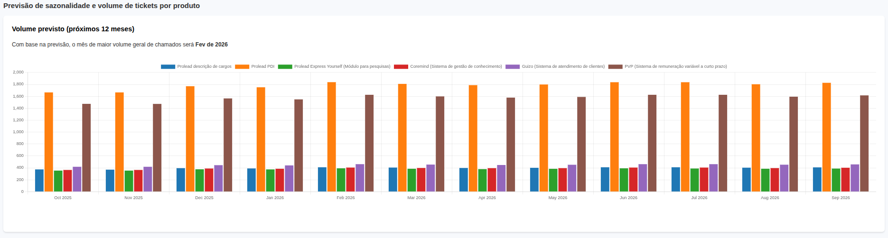
</div>
</details>
<details>
<summary>Criação da lógica para armazenamento de logs da aplicação </summary>
O sistema de logs da aplicação foi estruturado utilizando o SLF4J para a inserção programática dos registros. Para garantir o rastreamento detalhado de comandos, foi desenvolvido um EventListener customizado que é acionado na execução de cada comando.
Para fins de auditoria, um Filter do Spring foi configurado com sucesso, permitindo a captura e associação do identificador do usuário e do endpoint específico executado a cada requisição.
Todos esses registros são, então, persistidos e armazenados em uma collection no MongoDB, que serve como o repositório centralizado para a análise e monitoramento dos logs da aplicação.
Também criei o endpoint para realizar o export dos logs para csv
<div>
    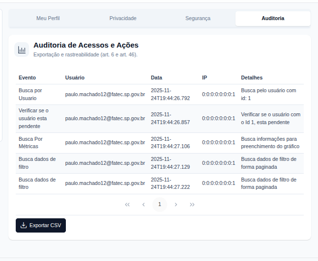
</div>
</details>
<details>
<summary>Criação da lógica do termo de uso </summary>
Desenvolvi um novo endpoint para a criação e gestão dos Termos de Uso da nossa aplicação. Implementei um trigger automatizado que, quando um novo termo é criado, ele é imediatamente atrelado a todos os usuários da plataforma. Consequentemente, configurei um controle de acesso obrigatório: o usuário só consegue utilizar a plataforma após a aceitação explícita dos checks obrigatórios contidos no novo Termo de Uso.
<div>
    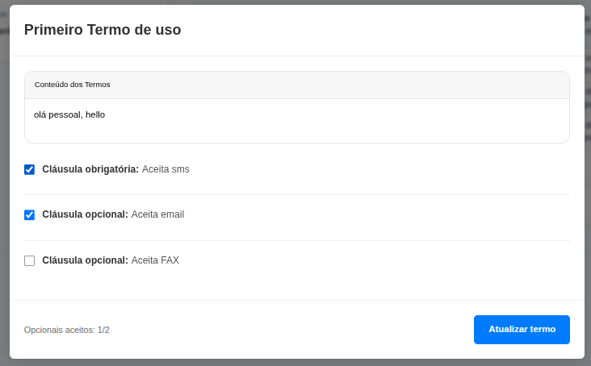
</div>
</details>
<details>
<summary>Mudança da lógica de cadastro na plataforma e criação dos emails </summary>
Para o cadastro na plataforma o novo úsuario deveria aceitar o termo de uspo e após isso, eu criei um completableFuture para que em um thread em parallelo a thread main enviaceum email relatando sobre o pré cadastro na palicação,  eo novo usuário só conseguiria utilizar a plataforma se o admin aprovace o seu cadastro então eu cria um email que dá essa informação do pré cadastrro para o novo usuário.
também criei o email de que qunaod o admin aprovacesse o cadastro chegaria um emai lfalando que o cadastro ocorreu com sucesso.
Para o processo de cadastro na plataforma, configurei o fluxo para que o novo usuário deva aceitar os Termos de Uso obrigatoriamente. Após a aceitação, utilizei o CompletableFuture para iniciar um processamento assíncrono em uma thread paralela à principal. Essa thread é responsável por enviar um e-mail ao novo usuário confirmando o pré-cadastro na aplicação.

O acesso completo à plataforma é condicionado à aprovação de um Administrador. Portanto, desenvolvi também dois modelos de notificação por e-mail:

1.Um e-mail informando o usuário sobre o status de pré-cadastro e a necessidade de aprovação.

2.Um segundo e-mail, de confirmação de sucesso, é disparado automaticamente assim que o Administrador aprova o cadastro, liberando o acesso total à plataforma.
<div>
    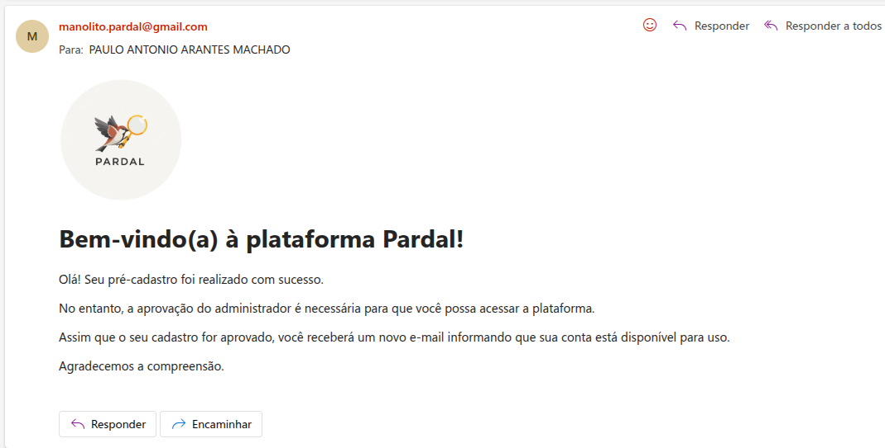
</div>
</details>
<details>
<summary>Melhoria da tela de Admin</summary>
Desenvolvi a lógica de Controle de Acesso Baseado em Roles, garantindo que somente usuários com a role de Administrador possam acessar a tela de gestão. Para viabilizar o fluxo de aprovação, adicionei as colunas Status e Ações à tabela de usuários já existente na tela de Admin. Essa interface permite que o Administrador aprove explicitamente os cadastros, sendo essa aprovação uma condição obrigatória para que o usuário possa utilizar a plataforma.
<div>
    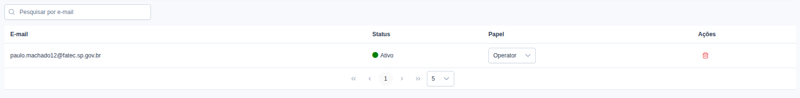
</div>
</details>
<details>
<summary>Implementação do CI no repositorio de front-end e back-end</summary>
Configurei um workflow no GitHub Actions (via arquivo YAML) para rodar o build da aplicação automaticamente a cada Pull Request (PR). Isso permite uma verificação imediata de que o código enviado compila corretamente.
<div>
    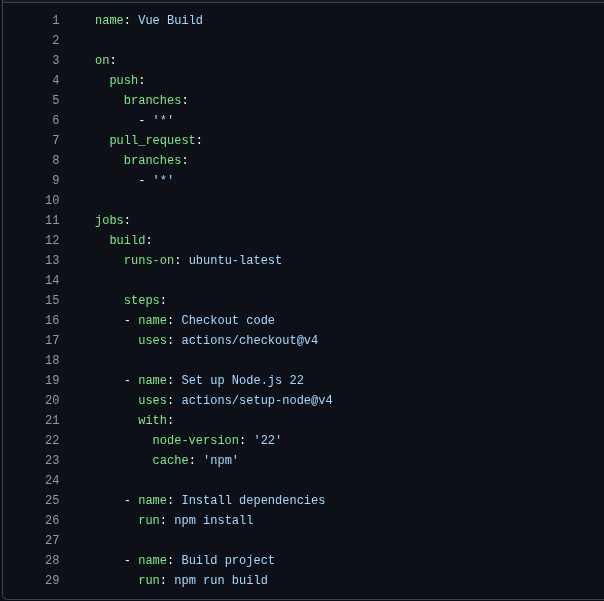
</div>
</details>
<details>
<summary>Implementação Sonar-cloud</summary>
Implementei um job dedicado no meu GitHub Actions workflow para integrar o SonarCloud. Este job executa a Análise Estática de Código (SAST) em cada build, com o objetivo principal de identificar e prevenir a duplicação de código, vulnerabilidades de segurança e code smells
<div>
    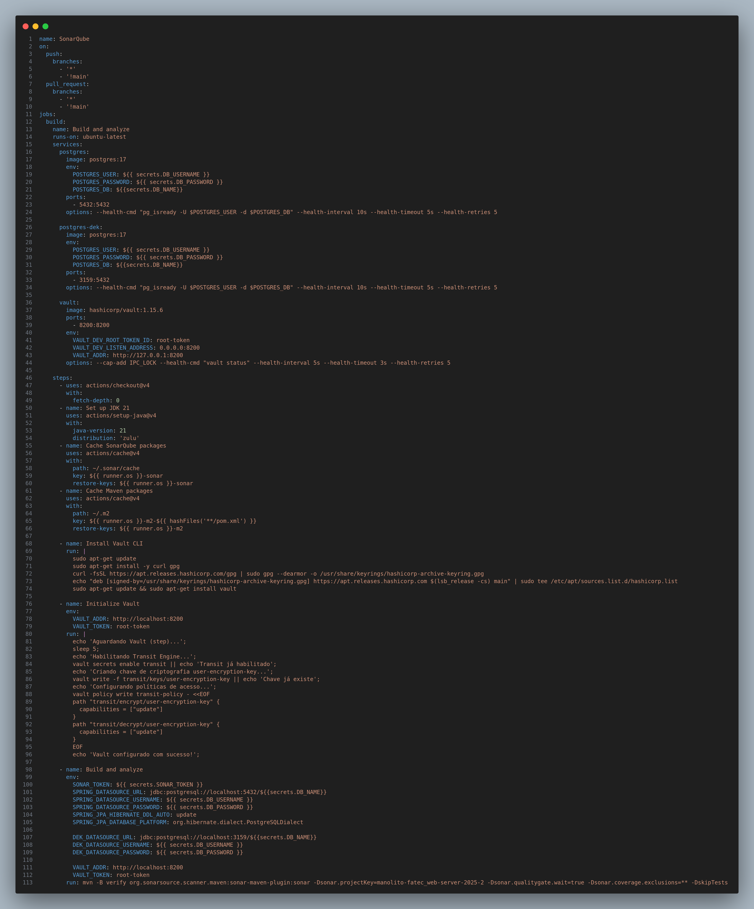
</div>
</details>
<br>

<h2>Hard Skills</h2>

Nome|Descrição|Nível
| :-------- | :-------- |:-------- |
|PROPHET| Utilizei a biblioteca Prophet (desenvolvida pelo Facebook) para a modelagem e treinamento de séries temporais|★★★☆☆|
|PYTHON|Utilizei Python no pipeline para orquestrar a fase de carga (Load). Após o cálculo das previsões, o código em Python é responsável por conectar-se diretamente ao MongoDB e armazenar todos os dados gerados pelo modelo.|★★★★☆|
|JUPYTER|Utilizei o Jupyter Notebook como ambiente de desenvolvimento interativo para treinar e gerar o modelo de forecasting|★★★★☆|
|MONGODB|Utilizei o mongo db para armazenar os daods do modelo de IA e também para armazenar os dados de Log da aplicação|★★★★☆|
|JPA CRITERIA API|Utilizei a JPA Criteria API para aprimorar a camada de persistência, possibilitando a construção programática de queries. Essa abordagem tornou as consultas de busca dinâmicas e altamente flexíveis, facilitando a implementação e o gerenciamento de filtros complexos na aplicação.|★★★★☆|
|SLF4J|Implementei o sistema de logs da aplicação utilizando o SLF4J (Simple Logging Facade for Java) para a injeção e manipulação dos registros. Em seguida, configurei o appender de log para garantir a persistência centralizada desses registros em uma collection dedicada no MongoDB.|★★★★☆|
|THYMELEAF JAVA|Implementei a criação de templates de e-mail em HTML utilizando o Thymeleaf em conjunto com a linguagem Java. Essa abordagem permitiu a injeção e o processamento de variáveis e dados dinâmicos do Java diretamente nos templates HTML, possibilitando o envio de comunicações personalizadas e contextualmente ricas para os usuários.|★★★★☆|
|DUCKDB|Utilizei o DunckDb para fazer conexão com o banco de dados postegresql para buscar dados para o treinamento de IA|★★★☆☆|
|KAGGLE|Fonte do dataset usado no treinamento do modelo preditivo.|★★★☆☆|


<h2>Soft Skills</h2>

Nome|Descrição|
| :-------- | :-------- |
|Gestão do Tempo e Organização |Habilidade de priorizar tarefas, cumprir prazos e utilizar o tempo de forma eficiente, mantendo o foco nas atividades de maior valor.|
|Autodesenvolvimento Contínuo| Busquei ativamente o Autodesenvolvimento Contínuo, adquirindo novos conhecimentos e ferramentas (como frameworks de design ou técnicas de otimização de queries) para solucionar desafios técnicos e aprimorar a qualidade do produto.|

---
